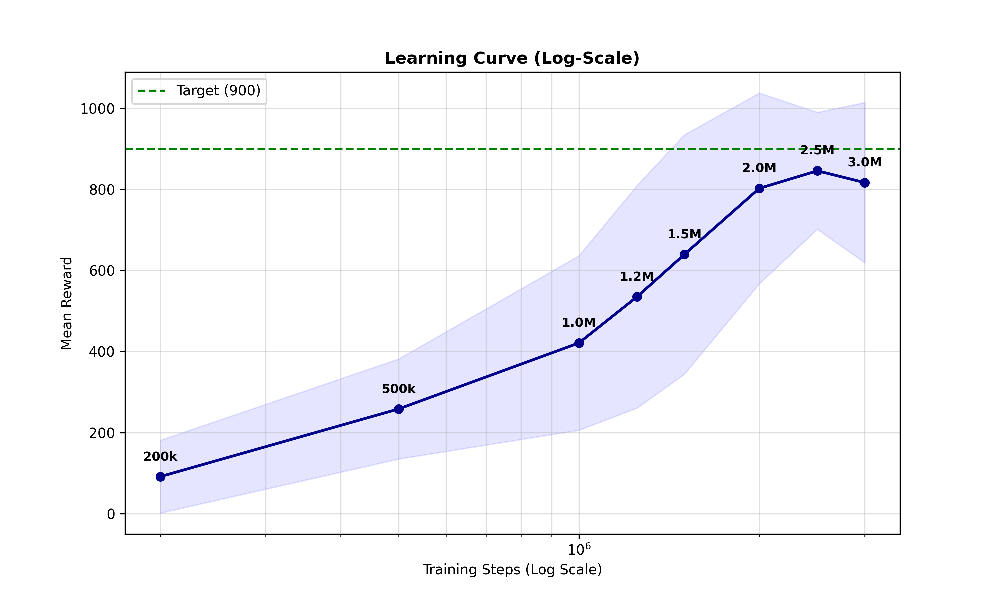
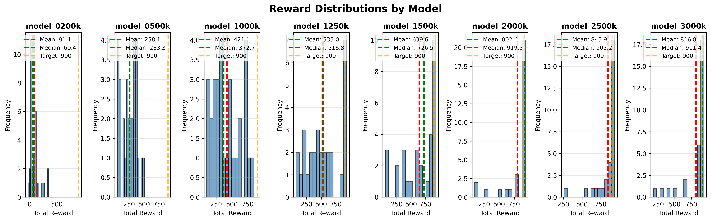
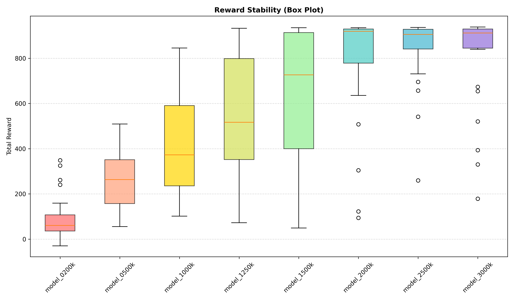
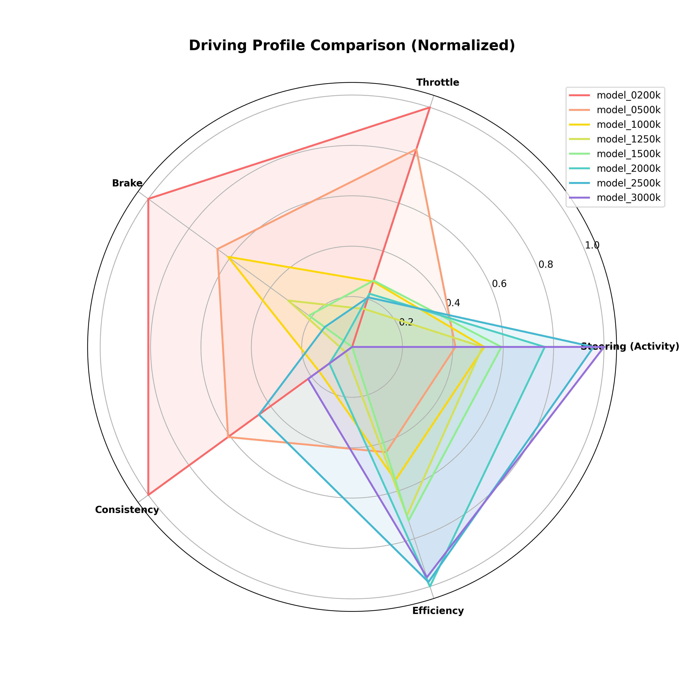

<script src="https://cdnjs.cloudflare.com/ajax/libs/mathjax/2.7.7/MathJax.js?config=TeX-AMS-MML_HTMLorMML" type="text/javascript"></script>

<script type="text/x-mathjax-config">
    MathJax.Hub.Config({ tex2jax: {inlineMath: [['$', '$']]}, messageStyle: "none" });
</script>

<script type="text/x-mathjax-config">
    MathJax.Hub.Config({ tex2jax: {inlineMath: [['$', '$']]}, messageStyle: "none" });
</script>
<script type="text/x-mathjax-config">
    MathJax.Hub.Config({ tex2jax: {inlineMath: [['$', '$']]}, messageStyle: "none" });
</script>

# Draft Report: Autonomous Driving via Proximal Policy Optimization (PPO)

**Date:** December 16, 2025  
**Subject:** Demonstrator of Self-Driving Car using PPO Method  
**Environment:** Gymnasium CarRacing-v3

---

## 1. Introduction
The objective of this project is to develop an autonomous agent capable of navigating a race track effectively. Using **Reinforcement Learning (RL)**, specifically the **Proximal Policy Optimization (PPO)** algorithm, the agent learns to control a vehicle in the `CarRacing-v2` environment.

Unlike rule-based systems, the agent learns purely from visual inputs (pixels) and trial-and-error interactions, aiming to maximize a reward signal based on speed and track completion. This implementation is built from scratch using **PyTorch** and **NumPy**, avoiding high-level abstractions like Stable Baselines3 to demonstrate a deep understanding of the underlying algorithms.

---

## 2. Short Theory Explanation

### 2.1 The Reinforcement Learning Problem
At its core, Reinforcement Learning (RL) involves an agent learning to make decisions by interacting with an environment to achieve a goal. We model this as a Markov Decision Process (MDP):

- **State ($s_{t}$):** The agent's current observation of the world (in our case, the stacked grayscale images of the track).
- **Action ($a_{t}$):** The decision made by the agent (steering, gas, brake).
- **Reward ($r_{t}$):** A scalar feedback signal indicating the immediate success of the action.

The agent's objective is not just to maximize the immediate reward, but to maximize the **cumulative reward** (return) over time.

### 2.2 The Essence of Policy Gradient and Its Challenges
To solve this MDP, we use **Policy Gradient methods**. These methods directly optimize the policy $\pi_\theta$ (the neural network) to maximize the expected return. They work by adjusting the network parameters $\theta$ in the direction that increases the probability of taking actions that lead to high rewards.

**The Challenge:** Traditional policy gradient methods (like REINFORCE) can be highly unstable.
* If the learning step size is too small, training is agonizingly slow.
* If the step size is too large, a single "bad" update can ruin the policy, causing performance to collapse. Once the policy degrades, the agent collects poor data, and it may never recover.

### 2.3 Proximal Policy Optimization (PPO) Explained
We utilize **PPO (Proximal Policy Optimization)**, an algorithm designed to strike a balance between sample efficiency and stability. As described in the literature, PPO acts as a successor to earlier methods by putting "guardrails" on the learning process.

#### 2.3.1 The Actor-Critic Architecture
Our implementation uses two distinct networks (or heads):
1.  **The Actor ($\pi_\theta$):** Decides which action to take. It outputs the distribution parameters (Mean and Standard Deviation) for steering, gas, and brake.
2.  **The Critic ($V_\phi$):** Estimates the value of the current state. This is crucial for computing the **Advantage**. This value acts as a **baseline** that is subtracted from the empirical return ($R_t$) to calculate the **Advantage** ($A_t = R_t - V(s)$).
  Theoretically, using this baseline reduces the **variance** of the policy gradient estimates without introducing bias. This relates to the definition of variance, $\text{Var}(X) = \mathbb{E}[(X - \mathbb{E}[X])^2]$; by minimizing the Mean Squared Error (MSE) between the predicted value and the actual return, the Critic effectively "centers" the learning signal, ensuring the training process remains stable.

#### 2.3.2 Value Function and Bellman Equation
The goal of the **Critic** component is to learn an accurate value function $V(s)$, which estimates the expected future return from a given state. To achieve this, training is grounded in the **Bellman Equation**, which establishes a fundamental recursive relationship: the value of the current state must equal the immediate reward plus the discounted value of the next state.

$$
V(s_t) \approx r_t + \gamma V(s_{t+1})
$$

During optimization, the Critic minimizes the Mean Squared Error (MSE) between its current prediction $V(s_t)$ and this "Bellman target" ($r_t + \gamma V(s_{t+1})$), thereby learning to better predict the long-term value of the agent's actions.
#### 2.3.3 The Advantage Function
PPO relies on the Advantage Function, $\hat{A}_t$, to guide updates. Instead of looking at raw rewards, the Advantage asks:
*> "How much better was this specific action compared to the average action the agent usually takes in this state?"*

$$\hat{A}_t = Q(s,a) - V(s)$$

This helps the algorithm focus specifically on actions that yield *unexpectedly* good results, reducing variance in training.

#### 2.3.4 The Clipped Surrogate Objective
The key innovation of PPO is how it updates the policy. It limits how much the policy can change in a single update using a **clipping mechanism**.

Let $r_t(\theta)$ be the probability ratio between the new policy and the old policy: $r_t(\theta) = \frac{\pi_{\theta}(a_t|s_t)}{\pi_{\theta_{old}}(a_t|s_t)}$.

The PPO objective function is:

$$
L^{CLIP}(\theta) = \hat{\mathbb{E}}_t \left[ \min \left( r_t(\theta)\hat{A}_t, \ \text{clip}\left( r_t(\theta), 1-\epsilon, 1+\epsilon \right)\hat{A}_t \right) \right]
$$

**Intuition:**
* If the advantage $\hat{A}_t$ is positive, we want to increase the probability of the action ($r_t > 1$).
* However, if $r_t$ grows beyond $1+\epsilon$ (usually 1.2), the clipping term kicks in.
* This effectively stops the update from being too drastic. It ensures the new policy stays **proximal** (close) to the old one, preventing the catastrophic forgetting common in standard RL.
---

## 3. Specification of Demonstrator Setting

This section defines the “Rules of the Game” and how the agent perceives and interacts with the world.

### 3.1 Environment Definition, Dynamics and Physics Modeling
It is crucial to understand that `CarRacing-v2` is not merely a video playback, but a rigid-body physics simulation powered by the **Box2D** engine. This engine handles the integration of forces, momentum, friction, and collisions, which directly dictates the complexity of the control task.

* **Environment ID:** `CarRacing-v2` (Gymnasium).
* **Type:** Continuous Control from visual inputs.
* **Rendering:** The environment renders a top-down view of the car and track.

#### 3.1.1 The Vehicle Model
The car is modeled as a compound object governed by Newtonian mechanics. Specifically:
* **Rigid Body Dynamics:** The car consists of a chassis (a rectangular polygon with mass and inertia) connected to four wheels via joints.
* **Rear-Wheel Drive:** The "Gas" action applies torque specifically to the rear wheels, generating propulsion.
* **Inertia and Momentum:** Unlike simple grid-world games, the agent does not control the vehicle's position or velocity directly. Instead, it applies **forces**. This means the car has momentum; it cannot stop instantly and will skid if the steering angle is too sharp at high speeds. The agent must learn to account for braking distances and drift dynamics.

#### 3.1.2 The Track and Surface Properties
To prevent the agent from simply memorizing a sequence of turns (overfitting), the track is **procedurally generated** at the start of each episode using randomized control points connected by Splines (Bézier curves).

Crucially, the physics engine simulates different surface properties:
* **Road (Poly1):** modelel with a high friction coefficient. This allows the tires to grip, enabling acceleration and turning.
* **Grass (Background):** Modeled with very low friction.
* **The "Tiles":** Although the rendering looks continuous, logically the track is divided into discrete "tiles" or checkpoints. These are invisible to the camera but are used by the environment to calculate the progress reward.

#### 3.1.3 Interaction and "Off-Track" Detection Logic
One of the most critical aspects of the environment is how it decides when the car has failed. This is handled via **Box2D Contact Listeners** (sensors):

1.  **Wheel Sensors:** The simulation continuously checks what material is essentially "under" each of the four wheels.
2.  **Friction Dynamics:** If a wheel touches the road, it has grip. If it touches the grass, it loses traction, making the car hard to control.
3.  **The Failure Condition:** The environment flags the car as "outside the track" when **all four wheels** lose contact with the road tiles simultaneously. In our implementation, we use this signal to trigger a harsh penalty and terminate the episode, teaching the agent that staying on the asphalt is the primary constraint.

### 3.2 Observation Space (State Representation)
The raw environment provides a $96 \times 96 \times 3$ RGB image. To enable the agent to perceive motion and reduce computational complexity, we implemented a custom wrapper pipeline:

1.  **Grayscale Conversion:** The 3-channel RGB image is converted to a single-channel grayscale image ($96 \times 96$). This focuses learning on shapes and road boundaries rather than colors, reducing the input dimensionality by a factor of 3.
2.  **Frame Stacking (Temporal Context):** We stack the **4 most recent frames** into a single observation. This transforms the input shape to $(4, 96, 96)$.
    * *Rationale:* A single static image contains no information about velocity or acceleration. By stacking frames, the Convolutional Neural Network (CNN) can infer the car's speed and turning direction from the differences between channels.
3.  **Normalization:** Input pixel values (integers $0-255$) are scaled to the floating-point range $[0.0, 1.0]$ immediately before being processed by the neural network. This stabilizes training gradients.

**Final State Shape:** Tensor of shape `(Batch_Size, 4, 96, 96)`.  
*Figure 1: Visual example of the `CarRacing-v2` (Gymnasium) environment.*

### 3.3 Action Space (Action Representation)
Unlike discrete environments (e.g., "Press Left" or "Press Right"), driving requires smooth, continuous adjustments. The agent operates in a continuous action space controlling three actuators. The Policy Network outputs a **Gaussian distribution** (mean and learnable standard deviation) for each action, from which values are sampled.

To enable exploration, the Actor network does not output a fixed action. Instead, for each action component, it outputs the parameters of a **Gaussian Distribution**: a **Mean ($\mu$)** and a learnable **Log-Standard Deviation ($\log\sigma$)**.

The action $a_t$ sent to the environment is sampled as:
$$
a_t \sim \mathcal{N}(\mu(s_t), \sigma(s_t))
$$
*During evaluation, we bypass sampling and use the mean $\mu$ directly for deterministic behavior.*

| Component | Range | Description |
| :--- | :--- | :--- |
| **Steering** | $[-1.0, 1.0]$ | Controls the wheel angle. $-1.0$ is full Left, $1.0$ is full Right. |
| **Gas** | $[0.0, 1.0]$ | Throttle/Acceleration intensity. |
| **Brake** | $[0.0, 1.0]$ | Braking intensity. |

### 3.4 Reward Function
The reward function $R(s, a)$ is the core signal that guides learning. We use the standard dense reward structure of `CarRacing-v2`, which implicitly balances speed and safety.

The total reward for an episode is calculated as:

$$
R_{episode} = \sum_{t=0}^{T} (r_{tile} + r_{time}) + r_{penalty}
$$

Where:
* **Progress Reward ($r_{tile}$):** The track is composed of $N$ tiles. Visiting a new tile yields $+1000/N$ points. Visiting all tiles results in $+1000$ points.
* **Time Penalty ($r_{time}$):** A constant penalty of $-0.1$ is applied at every time step. This forces the agent to drive fast; if it drives too slowly, the accumulated negative time penalty will outweigh the progress reward.
* **Safety Penalty ($r_{penalty}$):** If the car moves completely off the field of play (all wheels on grass), the episode terminates immediately with a penalty of $-100$.

* **Success Criterion:** The agent is considered to have "solved" the environment if it consistently achieves a score **> 900 points**, implying it completed the track reasonably fast with minimal errors.
---

## 4. Methods and Implementation Strategy

### 4.1 Neural Network Architecture
The architecture follows a standard **Actor-Critic** design sharing a common convolutional backbone, implemented in PyTorch.

1.  **Visual Encoder (Backbone):**
    * **Input:** $(4, 96, 96)$ (4 stacked grayscale frames).
    * **Conv1:** 32 filters, $8 \times 8$ kernel, stride 4. (Reduces spatial dimension efficiently).
    * **Conv2:** 64 filters, $4 \times 4$ kernel, stride 2.
    * **Conv3:** 64 filters, $3 \times 3$ kernel, stride 1.
    * **Flatten:** Converts the 3D feature maps into a 1D vector of 1024 features.
    * *Activation:* ReLU is used after each convolutional layer to introduce non-linearity.

2.  **Heads:**
    * **Actor (Policy):** Two fully connected layers (512 units $\to$ Action Dim). It outputs the **Mean ($\mu$)** of the action distribution. The **Standard Deviation ($\sigma$)** is learned as a separate independent parameter (`actor_logstd`), allowing the agent to adapt its exploration noise during training.
    * **Critic (Value):** Two fully connected layers (512 units $\to$ 1 unit) estimating the state value $V(s)$.


[Todo: Hablar del sistema de penalización implementado]: #


### 4.3 Technologies Used
- **Python 3.10+**
- **PyTorch:** neural network definition and gradient-based optimization.
- **NumPy:** numerical utilities and buffer manipulation.
- **Gymnasium:** environment interface (`CarRacing-v2`).


### 4.4 Training Loop Implementation Details

The training process is orchestrated in `train.py` using a vectorized architecture to maximize GPU efficiency. The algorithm follows a strict cycle of **Collection $\rightarrow$ Estimation $\rightarrow$ Optimization**, repeated until the total step budget (3M steps) is reached.

  
*Figure 2: Visual representation of the PPO training cycle, showing the data collection phase (filling the buffer) and the backpropagation phase (updating Actor and Critic).*

#### **Phase 1: Vectorized Environment Setup**
Instead of training on a single track, we initialize **8 parallel environments** (`num_envs=8`) using `gym.vector.AsyncVectorEnv`. This allows the agent to collect diverse experiences simultaneously, breaking the correlation between consecutive samples and stabilizing training.
* **Batch Size:** Each environment runs for 1,024 steps per iteration, resulting in a total batch size of **8,192 transitions** per update.
* **Annealing:** The learning rate linearly decays from $3 \times 10^{-4}$ to $0$ over the course of training.

#### **Phase 2: Data Collection (Rollout)**
In this phase, the agent interacts with the environment without updating its weights (`torch.no_grad()`). For each step $t$:
1.  **Action Selection:** The Actor network outputs a distribution $\mathcal{N}(\mu, \sigma)$. We sample an action $a_t$, its log-probability $\log \pi(a_t|s_t)$, and the estimated value $V(s_t)$.
2.  **Storage:** The transition $(s_t, a_t, r_t, d_t, \log \pi_t, V_t)$ is stored in a buffer on the GPU.

#### **Phase 3: Generalized Advantage Estimation (GAE)**

Once the trajectory buffer is full, we evaluate the quality of the actions taken by calculating the **Advantage** ($\hat{A}_t$). This metric quantifies how much better a specific action was compared to the Critic's average expectation ($V(s)$). To obtain a robust estimate that effectively balances bias and variance, we use **Generalized Advantage Estimation (GAE)** based on the **Bellman Error**.

**1. The Bellman Error (Temporal Difference)**
The process begins by calculating the **Bellman Error** (or Temporal Difference error, $\delta_t$) for each step. This error measures the discrepancy between the *observed reality* (immediate reward + discounted future value) and the *Critic's prediction*.

$$
\delta_t = r_t + \gamma V(s_{t+1})(1 - d_{t+1}) - V(s_t)
$$

In our implementation (`train.py`), this mathematical concept is translated explicitly into code:

```python
# Bellman Error (delta) calculation
# rewards[t]: Actual immediate reward
# nextvalues: Estimated value of the next state (V(s_{t+1}))
# values[t]:  Estimated value of the current state (V(s_t))

delta = rewards[t] + gamma * nextvalues * nextnonterminal - values[t]
```
**2. GAE Calculation (Backwards Smoothing)** We then propagate these local errors backwards in time to calculate the final advantage $\hat{A}_t$. This recursive formulation allows the agent to credit actions that lead to rewards in the distant future.

$$
\hat{A}_t = \delta_t + (\gamma \lambda) \hat{A}_{t+1}
$$

**Where:**

* **$\delta_t$:** Temporal Difference (TD) error at step $t$.
* **$r_t$:** Immediate reward received from the environment.
* **$V(s)$:** Value estimated by the Critic network.
* **$d_{t+1}$:** "Done" flag (1 if the episode ended, 0 otherwise).
* **$\gamma$ (Gamma):** Discount factor (set to 0.99), determining the weight of future rewards.
* **$\lambda$ (Lambda):** GAE smoothing parameter (set to 0.95), balancing bias vs. variance.

If the resulting Advantage $\hat{A}_t$ is positive, the action was better than expected, providing a positive signal to reinforce the policy.
#### **Phase 4: Optimization (Backpropagation)**
The collected batch (8,192 samples) is flattened and shuffled. The optimization runs for **10 epochs** (`update_epochs`) with minibatches of size 256. The weights are updated by minimizing the following **Total Loss function**:

$$
L_{total} = \underbrace{L^{CLIP}(\theta)}_{\text{Policy Loss}} + c_{vf} \underbrace{L^{VF}(\theta)}_{\text{Value Loss}} - c_{ent} \underbrace{S[\pi](s)}_{\text{Entropy Bonus}}
$$

**Where:**
* $c_{vf}$: Value coefficient (set to `0.5`).
* $c_{ent}$: Entropy coefficient (set to `0.01`).

Implementation details from `train.py`:

1.  **Policy Loss ($L^{CLIP}$):** We calculate the probability ratio $r_t(\theta) = \frac{\pi_{\theta}(a_t|s_t)}{\pi_{\theta_{old}}(a_t|s_t)}$. To prevent destructive updates, this ratio is clipped:
    $$L^{CLIP} = - \min \left( r_t \hat{A}_t, \ \text{clip}(r_t, 1-\epsilon, 1+\epsilon) \hat{A}_t \right)$$
    * $\epsilon$ (**Epsilon**): Clipping coefficient (set to `0.2`), limiting the policy change to $\pm 20\%$.
    * $\hat{A}_t$: Normalized Advantage estimate.

2.  **Value Loss ($L^{VF}$):** The Critic is trained to minimize the Mean Squared Error (MSE) between its prediction and the computed returns:
    $$L^{VF} = 0.5 \cdot (V_{\theta}(s_t) - R_t)^2$$
    * $R_t$: The calculated return ($A_t + V_t$).

3.  **Entropy Bonus ($S[\pi]$):** The entropy of the distribution is subtracted from the loss to encourage exploration, preventing the agent from becoming deterministic too early.

4.  **Gradient Clipping:** Finally, the global norm of the gradients is clipped to `0.5` before the optimizer step to ensure stability.
---

## 5. Evaluation of the Training Process and Results

To validate the effectiveness of the custom PPO implementation, a structured evaluation protocol is applied. The goal is to quantify how performance improves with more experience, how stable the learned policy is, and whether the behavior is suitable for autonomous driving.

### 5.1 Experimental Setup

#### 5.1.1 Trained Checkpoints
The training process was continuously monitored to analyze the evolution of the agent's driving capabilities across different stages of convergence. We evaluated **eight distinct PPO agents**, saved at increasing interaction budgets:

* **Model 200k steps** 
* **Model 500k steps**
* **Model 1.0M steps**
* **Model 1.25M steps**
* **Model 1.5M steps**
* **Model 2.0M steps** 
* **Model 2.5M steps** 
* **Model 3.0M steps** 

Each "step" corresponds to one environment transition in the vectorized setting using the hyperparameters defined in the training configuration (learning rate of 3e-4, batch size of 8192, and gamma of 0.99).

#### 5.1.2 Methodology Refinement & Evaluation Protocol

Initially, the training was conducted using the standard environment configuration (`train.py`) and evaluated using default metrics. However, an in-depth analysis of these preliminary results revealed inconsistent behaviors. While the agents were often able to complete the maximum episode length (1000 steps), visual inspection via video logs showed that the driving was erratic. The agents frequently survived by spinning in circles or drifting off-track without being penalized sufficiently, exploiting the survival reward rather than learning proper lane-keeping.

**Hypothesis:**
For an autonomous vehicle, safety and road adherence must take precedence over raw velocity. We hypothesized that introducing a strict negative penalty for leaving the designated track would force the agent to learn stability and reduce "cheating" behaviors.

**Reward Policy Evolution:**
To test this hypothesis, we formally defined two distinct reward policies used during the experimentation phase.

**A. Baseline Policy (Standard CarRacing-v2)**
*Used in initial training experiments (`train.py`).*

The default reward structure focuses purely on velocity and track completion. The reward $R_t$ at step $t$ is defined as:
$$R_t = \left( \frac{1000}{N} \cdot \Delta_{visited} \right) - 0.1$$

**Where:**
* $N$: The total number of track tiles in the generated circuit.
* $\Delta_{visited}$: The number of **new** track tiles visited in the current step (usually $1$ or $0$).
* $1000/N$: The normalized reward points gained for visiting a new tile.
* $-0.1$: A constant time penalty applied at every frame to encourage faster driving.
* **Deficiency:** There is no explicit negative reward for driving on the grass, allowing the agent to cut corners or survive off-track.

**B. Robust Policy (Implementation: Grass Penalty)**
*Used for the final evaluated models (`train2.py`).*

To address the baseline deficiencies, we implemented a custom `GrassPenaltyWrapper` that modifies the reward structure based on visual feedback. The new reward function is:

$$R_t^{\prime} = R_t - P_{grass}$$

The penalty logic ($P_{grass}$) is implemented as follows:

1.  **RGB Detection:** The wrapper analyzes the original RGB observation to detect "grass" pixels using a specific color filter (Green channel $> 150$, while Red and Blue $< 100$).
2.  **Penalty Application ($P_{grass}$):** If the ratio of green pixels in the agent's view exceeds **25%** ($green\_ratio > 0.25$), a strictly negative penalty ($-0.8$) is subtracted from the reward at each step:
* **If *green_ratio* > 0.25:** The car is considered off-track.
    * **Penalty Applied:** *P_grass* = **0.8**
* **Otherwise:**
    * **Penalty:** *P_grass* = **0**
3.  **Early Termination:** To prevent the agent from wandering indefinitely in the field, the episode is automatically terminated if the car remains off-track for more than **50 consecutive frames** ($max\_off\_track$).

**Evaluation Metrics:**
For the comparative analysis, we use **Mean Reward** to assess driving quality and **Win Rate** ($\%$ episodes $> 900$ points) to determine optimal racing behavior.

**Evaluation Protocol:**
For the final comparative analysis, we employed a strict protocol to ensure robustness:
* **\(N = 30\)** evaluation episodes per model with **fixed random seeds** for reproducibility.
* **No exploration noise:** Actions are determined deterministically by the policy mean.
* **Key Metrics:** We focus on the **Mean Reward** (to assess the overall quality of driving) and the **Win Rate** (percentage of episodes with reward \(> 900\)) to distinguish between consistently good performance and optimal racing behavior.


## 5.2 Impact of Training Duration (Policy B Analysis)

To understand the evolution of the agent's driving capabilities under the **Grass Penalty Policy (Policy B)**, we evaluated 8 distinct checkpoints ranging from **200,000 steps** to **3,000,000 steps**.

This analysis relies on the premise that adding a specific penalty for driving off-track ($r_{grass}$) forces the agent to learn "true" driving physics rather than cutting corners, potentially altering the learning curve compared to standard PPO implementations.

### 5.2.1 Learning Curve Analysis

The training progression follows a clear **S-curve (Sigmoid-like) trajectory**, which can be divided into three distinct phases of learning:


*Figure 3: Learning Progression of the Grass Penalty Agent (Policy B).*
1.  **Exploration Phase (200k - 500k steps):**
    * The agent is still discovering the basic mechanics. At **200k steps**, the mean reward is merely **91.1**, indicating the car struggles to stay on track for more than a few seconds.
    * By **500k steps**, the reward jumps to **258.1**. The agent has learned to accelerate but lacks the finesse to handle sharp turns without triggering the grass penalty.

2.  **Rapid Improvement Phase (1M - 2M steps):**
    * This is the steepest part of the curve. The agent transitions from "barely surviving" to "competent racing."
    * Between **1.0M** and **1.5M steps**, the win rate (episodes > 900 points) emerges for the first time, rising from 0% to 33.3%, signaling that the agent is starting to complete laps cleanly.
    * By **2.0M steps**, the agent achieves a high mean reward of **802.6**, with a peak win rate of **70.0%**.

3.  **Saturation and Stability Phase (2.5M - 3M steps):**
    * At **2.5M steps**, the mean reward peaks at **845.9**. Interestingly, while the mean reward is higher than at 2.0M, the win rate drops slightly to 53.3%. This discrepancy is explained by the **standard deviation**, which drops significantly (from 235.3 to 144.3).
    * This indicates that the **2.5M model is more robust**: it raises the "floor" of performance (higher minimum scores), avoiding catastrophic failures, even if it hits the perfect >900 score slightly less often than the aggressive 2.0M model.
    * At **3.0M steps**, performance plateaus, confirming that ~2.5M steps is the optimal training budget for this configuration.

### 5.2.2 Quantitative Metrics Breakdown

The following table summarizes the performance evolution across all 8 evaluated checkpoints. Data is aggregated from 30 evaluation episodes per model.

| Model (Steps) | Mean Reward | Std. Dev. | Win Rate (>900) | Avg. Steps |
| :--- | :--- | :--- | :--- | :--- |
| **200k** | 91.14 | 89.79 | 0.0% | 243 |
| **500k** | 258.14 | 123.40 | 0.0% | 361 |
| **1.0M** | 421.08 | 215.24 | 0.0% | 523 |
| **1.25M** | 535.04 | 274.47 | 23.3% | 582 |
| **1.5M** | 639.60 | 295.38 | 33.3% | 684 |
| **2.0M** | 802.58 | 235.34 | **70.0%** | 699 |
| **2.5M** | **845.90** | **144.28** | 53.3% | 746 |
| **3.0M** | 816.80 | 197.76 | 53.3% | 730 |
*Table 1: Evolution of performance metrics. Note the trade-off between peak Win Rate (2.0M) and Stability/Mean Reward (2.5M).*


*Figure 3: Reward Distribution Analysis by Training Step. These histograms visualize the probability density of returns for each model checkpoint. The dashed orange line represents the "solved" threshold (900 points). The progression illustrates a clear shift from low-reward failure modes (200k-500k) to high-variance exploration (1.0M-1.5M) and finally to stable, high-performance behaviors (2.0M-3.0M), visually confirming the standard deviation reduction observed in Table 1.*

### 5.3 Qualitative Behaviour Analysis

Numbers alone do not capture the quality of driving. Therefore, evaluation videos are recorded for each checkpoint.

- **Model A (500K):**
  - Tends to over-steer and oscillate around the track center.
  - Frequently leaves the track, leading to early termination and low scores.
- **Model B (1M):**
  - Handles most corners reasonably well.
  - Still exhibits occasional over-corrections and slower recovery after mistakes.
- **Model C (2M):**
  - Follows the track smoothly with anticipatory steering.
  - Maintains higher speed on straights while braking appropriately before sharp turns.
  - Visually resembles human-like driving and completes most laps without leaving the track.

Selected frames and short clips can be embedded in the presentation to illustrate the progression from unstable to reliable driving.

## 5.4 Stability and Control Signals

Analyzing the internal telemetry of the agent reveals how its driving strategy matures over time. We focus on two key aspects: the **stability of the reward** (reliability) and the **evolution of control inputs** (steering, throttle, and brake).

### 5.4.1 Reward Stability Analysis

Stability is measured by the **Standard Deviation ($\sigma$)** of the total reward across evaluation episodes. A lower $\sigma$ indicates a more predictable and robust driver.


*Figure 4: Distribution of rewards across training checkpoints. The "height" of each box represents the Interquartile Range (IQR). Note how the 2.5M model exhibits the most compact distribution among the high-performing agents, indicating superior consistency.*

* **The "Nervous" Phase (1.0M - 2.0M steps):**
    The model at **1.0M steps** shows a high deviation ($\sigma \approx 215$), which peaks at **1.5M steps** ($\sigma \approx 295$). During this phase, the agent is capable of high scores but frequently commits critical errors, leading to a wide spread of results (long "whiskers" in the boxplot).

* **The "Reliable" Phase (2.5M steps):**
    At **2.5M steps**, we observe a drastic drop in standard deviation to **$\sigma = 144.28$**, the lowest among the high-performing models. This confirms that the agent has consolidated its policy, eliminating most catastrophic failures. Although the 2.0M model achieved a higher peak win rate (70%), it was significantly less stable ($\sigma = 235.34$), making the **2.5M model the superior candidate for deployment** due to its consistency.

### 5.4.2 Control Signals Evolution

The average values of the actions taken by the agent (Steering, Gas, Brake) tell a compelling story about energy efficiency and control confidence.


*Figure 5: Radar chart comparing the normalized control profiles. The 200k model (Red) shows a bias towards Throttle, while the mature 2.5M model (Blue) expands towards Efficiency and Brake usage.*

| Model (Steps) | Throttle (Mean) | Brake (Mean) | Interpretation |
| :--- | :--- | :--- | :--- |
| **200k** | **0.372** | -0.515 | **Constant Acceleration:** The novice agent holds the gas down, leading to loss of control. |
| **1.0M** | -0.276 | -0.857 | **Learning to Let Go:** The agent starts to release the gas pedal more often. |
| **2.5M** | **-0.334** | **-1.273** | **Controlled Coasting:** The expert agent relies on momentum. |

*Note: In the PPO continuous action space, negative output values correspond to a "do nothing" action (0.0) after clipping. A strongly negative mean indicates the agent is confident in **not** activating that pedal.*

1.  **Throttle (Gas):**
    * Early models (**200k**) exhibit a **positive mean throttle (0.37)**, indicating the agent is constantly pressing the accelerator. This explains the erratic behavior and frequent off-track excursions.
    * As training progresses, the mean throttle drops significantly, becoming negative (**-0.33 at 2.5M**). This implies the converged agent has learned to **"coast"** (release the gas) for large sections of the track, applying power only when necessary to maintain speed or exit corners. This is a hallmark of smooth, professional racing lines versus the "floor-it" strategy of a beginner.

2.  **Brake:**
    * The brake signal remains deeply negative across all models (dropping from -0.51 to -1.39). The increasingly negative value at 2.5M (-1.27) suggests the agent has learned to keep the brake pedal "far from activation" to avoid accidental braking due to exploration noise, applying it only in sharp, decisive bursts.

3.  **Steering:**
    * The mean steering value remains close to zero (e.g., **-0.05 at 2.5M**), which is expected for a circuit with a balance of left and right turns. The low magnitude suggests the agent stays centered and avoids excessive zig-zagging corrections, further contributing to the stability observed in section 5.4.1.

### 5.4.3 Visual Analytics Methodology

To ensure a rigorous interpretation of the graphical data presented in Figure 4 (Boxplots) and Figure 5 (Radar Chart), we define the calculated metrics and statistical elements as follows, based on the evaluation of 30 episodes per model.

**A. Boxplot Statistics (Stability Analysis)**
The reward distribution is visualized using standard statistical boxplots (Figure 4). The elements are defined as follows:
* **The Box (Interquartile Range - IQR):** Represents the central 50% of the data, spanning from the **1st Quartile ($Q1$, 25th percentile)** to the **3rd Quartile ($Q3$, 75th percentile)**. A vertically shorter box indicates high clustering of results, synonymous with high reliability.
* **The Whiskers:** Extend to the most extreme data points within the range of $1.5 \times IQR$ from the box edges. They visualize the expected variability of the model.
* **Points (Outliers):** Individual episodes falling outside the whiskers. These represent anomalies—rare failures or exceptionally lucky runs.

**B. Control Radar Derived Metrics (Control Analysis)**
The Control Radar (Figure 5) visualizes the agent's driving "personality" by normalizing raw telemetry data. In addition to raw control inputs (Throttle, Brake), we introduce two derived metrics:
* **Efficiency ($\eta$):** Calculated as the ratio of reward to duration ($\eta = \frac{\text{Mean Reward}}{\text{Avg Steps}}$). This metric penalizes "slow and safe" driving. High efficiency indicates the agent maximizes points per second, finding optimal racing lines rather than merely surviving.
* **Consistency ($C$):** Defined as the inverse of the standard deviation ($C = \frac{1}{\sigma + \epsilon}$). This metric rewards reproducibility; a high consistency score implies the agent's performance is almost identical across all test episodes, minimizing the variance caused by random initialization or noise.

### 5.5 Limitations

Despite the positive results, the evaluation reveals some limitations:

- Performance still degrades on extremely sharp or unusual track configurations.
- The agent is trained and tested in a single simulated environment; transfer to real-world conditions is not addressed.
- All evaluations are done under similar observation and reward settings; robustness to sensor noise or modified rewards is not yet studied.

These points motivate future work, such as domain randomization, curriculum learning, or alternative architectures.

### 5.6 Generalization vs. Memorization: Random Seeds vs Fixed Track

To study whether the agent truly *learns to drive* or merely *memorizes a specific track*, two PPO agents with identical architectures and hyperparameters are trained:

- **Generalist Agent (Random Seeds):**
  - Trained on procedurally generated tracks with a different random seed at every episode.
  - Objective: learn generic driving skills (cornering, speed control, recovery) that transfer across layouts.

- **Specialist Agent (Fixed Seed):**
  - Trained on a single, fixed track layout using a constant environment seed.
  - Objective: intentionally encourage memorization of that specific circuit.

Both agents are trained for the same number of environment steps (e.g. **1.0M** or **2.0M** steps), so that differences in performance can be attributed to the training distribution rather than to training budget.

#### 5.6.1 Evaluation Protocol

To compare *generalization* and *memorization*, each agent is evaluated under two conditions:

1. **Random-track evaluation (unseen layouts):**
   - Environment seeds are sampled randomly at every episode.
   - Measures how well the policy adapts to new tracks it has never seen before.

2. **Fixed-track evaluation (memorized layout):**
   - The environment is reset with the **same seed used to train the Specialist Agent**.
   - Measures how strongly each policy overfits to that single circuit.

For each condition and each agent we run **N evaluation episodes** (e.g. \(N = 20\)) with deterministic actions (policy mean, no exploration noise) and record:

- Episode total reward
- Episode length
- Win rate (percentage of episodes with reward \(> 900\))

#### 5.6.2 Quantitative Results

The following table summarizes the expected behaviour (values to be filled in with experimental results):

| Agent / Evaluation seed      | Mean reward | Std. dev. | Win rate (> 900) |
|----------------------------- |-----------:|----------:|-----------------:|
| **Generalist – Random tracks** | xxx.x      |  xxx.x    |        xx.x %    |
| **Generalist – Fixed track**   | xxx.x      |  xxx.x    |        xx.x %    |
| **Specialist – Random tracks** | xxx.x      |  xxx.x    |        xx.x %    |
| **Specialist – Fixed track**   | xxx.x      |  xxx.x    |        xx.x %    |

#### 5.6.3 Discussion

The expected pattern is:

- On the **fixed track**, the Specialist Agent should achieve very high scores and win rates, sometimes outperforming the Generalist Agent, as it has effectively memorized that layout.
- On **random tracks**, the Specialist Agent is likely to degrade significantly, with:
  - Lower mean reward,
  - Higher variance,
  - Lower win rate,
  indicating poor robustness to unseen circuits.
- The **Generalist Agent** should maintain more stable performance across both evaluation conditions, with smaller gaps between fixed and random tracks, which is a strong indication of *true generalization* rather than memorization.

This experiment illustrates a classical trade-off:
- Training on **diverse seeds** leads to more robust but slightly slower-learning agents.
- Training on a **fixed seed** encourages rapid improvement on that specific scenario at the cost of poor out-of-distribution performance.

In the context of autonomous driving, the Generalist Agent is clearly preferable, since real roads are never identical to the training track.

---

## 6. Delivery and Usage

The final project deliverable is structured as an archive containing:

1. **Source Code**
   - Training script (`train.py`)
   - Evaluation script (`evaluate.py` / extended evaluation tools)
   - Agent and utility modules (`agent.py`, `utils.py`)

2. **Trained Models**
   - Checkpoints for 500K, 1M and 2M training steps.
   - Final best-performing model.

3. **Requirements**
   - `requirements.txt` specifying Python dependencies (Gymnasium, PyTorch, NumPy, etc.).

### 6.1 How to Run

1. **Install dependencies:**
   ```bash
   pip install -r requirements.txt
