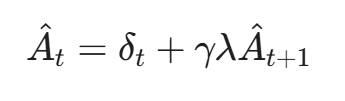
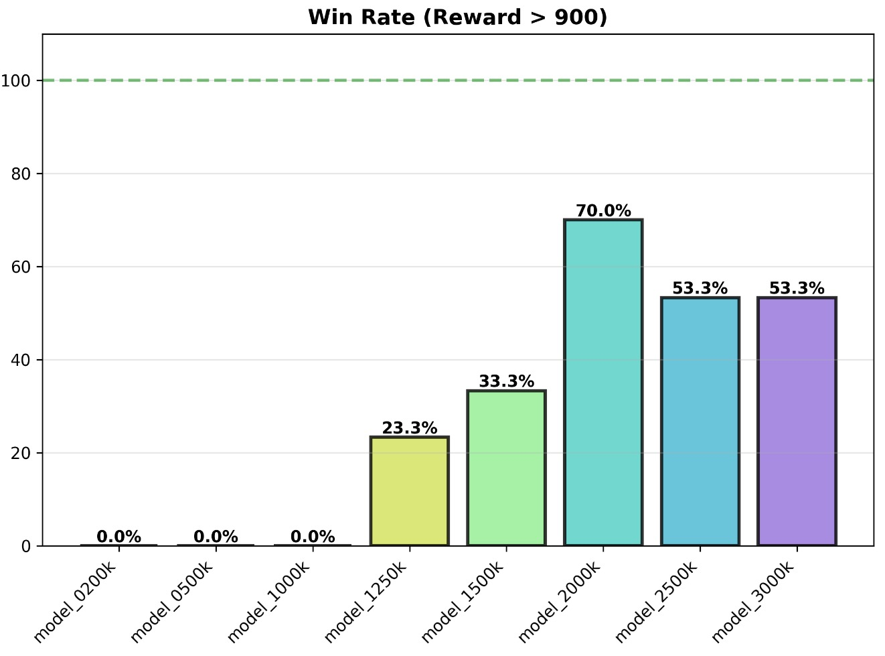

<script src="https://cdnjs.cloudflare.com/ajax/libs/mathjax/2.7.7/MathJax.js?config=TeX-AMS-MML_HTMLorMML" type="text/javascript"></script>

<script type="text/x-mathjax-config">
    MathJax.Hub.Config({ tex2jax: {inlineMath: [['$', '$']]}, messageStyle: "none" });
</script>

<script type="text/x-mathjax-config">
    MathJax.Hub.Config({ tex2jax: {inlineMath: [['$', '$']]}, messageStyle: "none" });
</script>
<script type="text/x-mathjax-config">
    MathJax.Hub.Config({ tex2jax: {inlineMath: [['$', '$']]}, messageStyle: "none" });
</script>

<script type="text/x-mathjax-config">
    MathJax.Hub.Config({ tex2jax: {inlineMath: [['$', '$']]}, messageStyle: "none" });
</script>

<script type="text/x-mathjax-config">
    MathJax.Hub.Config({ tex2jax: {inlineMath: [['$', '$']]}, messageStyle: "none" });
</script>
<script type="text/x-mathjax-config">
    MathJax.Hub.Config({ tex2jax: {inlineMath: [['$', '$']]}, messageStyle: "none" });
</script>

# Draft Report: Autonomous Driving via Proximal Policy Optimization (PPO)

**Date:** December 16, 2025  
**Subject:** Demonstrator of Self-Driving Car using PPO Method  
**Environment:** Gymnasium CarRacing-v3

---

<div style="page-break-after: always;"></div>

## 1. Introduction
The objective of this project is to develop an autonomous agent capable of navigating a race track effectively. Using **Reinforcement Learning (RL)**, specifically the **Proximal Policy Optimization (PPO)** algorithm, the agent learns to control a vehicle in the `CarRacing-v2` environment.

Unlike rule-based systems, the agent learns purely from visual inputs (pixels) and trial-and-error interactions, aiming to maximize a reward signal based on speed and track completion. This implementation is built from scratch using **PyTorch** and **NumPy**, avoiding high-level abstractions like Stable Baselines3 to demonstrate a deep understanding of the underlying algorithms.

---

<div style="page-break-after: always;"></div>

## 2. Short Theory Explanation

### 2.1 The Reinforcement Learning Problem
At its core, Reinforcement Learning (RL) involves an agent learning to make decisions by interacting with an environment to achieve a goal. We model this as a Markov Decision Process (MDP):

- **State ($s_{t}$):** The agent's current observation of the world (in our case, the stacked grayscale images of the track).
- **Action ($a_{t}$):** The decision made by the agent (steering, gas, brake).
- **Reward ($r_{t}$):** A scalar feedback signal indicating the immediate success of the action.

The agent's objective is not just to maximize the immediate reward, but to maximize the **cumulative reward** (return) over time.

### 2.2 The Essence of Policy Gradient and Its Challenges
To solve this MDP, we use **Policy Gradient methods**. These methods directly optimize the policy $\pi_\theta$ (the neural network) to maximize the expected return. They work by adjusting the network parameters $\theta$ in the direction that increases the probability of taking actions that lead to high rewards.

**The Challenge:** Traditional policy gradient methods (like REINFORCE) can be highly unstable.
* If the learning step size is too small, training is agonizingly slow.
* If the step size is too large, a single "bad" update can ruin the policy, causing performance to collapse. Once the policy degrades, the agent collects poor data, and it may never recover.

### 2.3 Proximal Policy Optimization (PPO) Explained
We utilize **PPO (Proximal Policy Optimization)**, an algorithm designed to strike a balance between sample efficiency and stability. As described in the literature, PPO acts as a successor to earlier methods by putting "guardrails" on the learning process.

#### 2.3.1 The Actor-Critic Architecture
Our implementation uses two distinct networks (or heads):
1.  **The Actor ($\pi_\theta$):** Decides which action to take. It outputs the distribution parameters (Mean and Standard Deviation) for steering, gas, and brake.
2.  **The Critic ($V_\phi$):** Estimates the value of the current state. This is crucial for computing the **Advantage**. This value acts as a **baseline** that is subtracted from the empirical return ($R_t$) to calculate the **Advantage** ($A_t = R_t - V(s)$).
  Theoretically, using this baseline reduces the **variance** of the policy gradient estimates without introducing bias. This relates to the definition of variance, $\text{Var}(X) = \mathbb{E}[(X - \mathbb{E}[X])^2]$; by minimizing the Mean Squared Error (MSE) between the predicted value and the actual return, the Critic effectively "centers" the learning signal, ensuring the training process remains stable.

#### 2.3.2 Value Function and Bellman Equation
The goal of the **Critic** component is to learn an accurate value function $V(s)$, which estimates the expected future return from a given state. To achieve this, training is grounded in the **Bellman Equation**, which establishes a fundamental recursive relationship: the value of the current state must equal the immediate reward plus the discounted value of the next state.

$$
V(s_t) \approx r_t + \gamma V(s_{t+1})
$$

During optimization, the Critic minimizes the Mean Squared Error (MSE) between its current prediction $V(s_t)$ and this "Bellman target" ($r_t + \gamma V(s_{t+1})$), thereby learning to better predict the long-term value of the agent's actions.
#### 2.3.3 The Advantage Function
PPO relies on the Advantage Function, $\hat{A}_t$, to guide updates. Instead of looking at raw rewards, the Advantage asks:
*> "How much better was this specific action compared to the average action the agent usually takes in this state?"*

$$\hat{A}_t = Q(s,a) - V(s)$$

This helps the algorithm focus specifically on actions that yield *unexpectedly* good results, reducing variance in training.

#### 2.3.4 The Clipped Surrogate Objective
The key innovation of PPO is how it updates the policy. It limits how much the policy can change in a single update using a **clipping mechanism**.

Let $r_t(\theta)$ be the probability ratio between the new policy and the old policy: $r_t(\theta) = \frac{\pi_{\theta}(a_t|s_t)}{\pi_{\theta_{old}}(a_t|s_t)}$.

The PPO objective function is:

$$
L^{CLIP}(\theta) = \hat{\mathbb{E}}_t \left[ \min \left( r_t(\theta)\hat{A}_t, \ \text{clip}\left( r_t(\theta), 1-\epsilon, 1+\epsilon \right)\hat{A}_t \right) \right]
$$

**Intuition:**
* If the advantage $\hat{A}_t$ is positive, we want to increase the probability of the action ($r_t > 1$).
* However, if $r_t$ grows beyond $1+\epsilon$ (usually 1.2), the clipping term kicks in.
* This effectively stops the update from being too drastic. It ensures the new policy stays **proximal** (close) to the old one, preventing the catastrophic forgetting common in standard RL.
---

<div style="page-break-after: always;"></div>

## 3. Specification of Demonstrator Setting

This section defines the “Rules of the Game” and how the agent perceives and interacts with the world.

### 3.1 Environment Definition, Dynamics and Physics Modeling
It is crucial to understand that `CarRacing-v2` is not merely a video playback, but a rigid-body physics simulation powered by the **Box2D** engine. This engine handles the integration of forces, momentum, friction, and collisions, which directly dictates the complexity of the control task.

* **Environment ID:** `CarRacing-v2` (Gymnasium).
* **Type:** Continuous Control from visual inputs.
* **Rendering:** The environment renders a top-down view of the car and track.

#### 3.1.1 The Vehicle Model
The car is modeled as a compound object governed by Newtonian mechanics. Specifically:
* **Rigid Body Dynamics:** The car consists of a chassis (a rectangular polygon with mass and inertia) connected to four wheels via joints.
* **Rear-Wheel Drive:** The "Gas" action applies torque specifically to the rear wheels, generating propulsion.
* **Inertia and Momentum:** Unlike simple grid-world games, the agent does not control the vehicle's position or velocity directly. Instead, it applies **forces**. This means the car has momentum; it cannot stop instantly and will skid if the steering angle is too sharp at high speeds. The agent must learn to account for braking distances and drift dynamics.

#### 3.1.2 The Track and Surface Properties
To prevent the agent from simply memorizing a sequence of turns (overfitting), the track is **procedurally generated** at the start of each episode using randomized control points connected by Splines (Bézier curves).

Crucially, the physics engine simulates different surface properties:
* **Road (Poly1):** modelel with a high friction coefficient. This allows the tires to grip, enabling acceleration and turning.
* **Grass (Background):** Modeled with very low friction.
* **The "Tiles":** Although the rendering looks continuous, logically the track is divided into discrete "tiles" or checkpoints. These are invisible to the camera but are used by the environment to calculate the progress reward.

#### 3.1.3 Interaction and "Off-Track" Detection Logic
One of the most critical aspects of the environment is how it decides when the car has failed. This is handled via **Box2D Contact Listeners** (sensors):

1.  **Wheel Sensors:** The simulation continuously checks what material is essentially "under" each of the four wheels.
2.  **Friction Dynamics:** If a wheel touches the road, it has grip. If it touches the grass, it loses traction, making the car hard to control.
3.  **The Failure Condition:** The environment flags the car as "outside the track" when **all four wheels** lose contact with the road tiles simultaneously. In our implementation, we use this signal to trigger a harsh penalty and terminate the episode, teaching the agent that staying on the asphalt is the primary constraint.

### 3.2 Observation Space (State Representation)
The raw environment provides a $96 \times 96 \times 3$ RGB image. To enable the agent to perceive motion and reduce computational complexity, we implemented a custom wrapper pipeline:

1.  **Grayscale Conversion:** The 3-channel RGB image is converted to a single-channel grayscale image ($96 \times 96$). This focuses learning on shapes and road boundaries rather than colors, reducing the input dimensionality by a factor of 3.
2.  **Frame Stacking (Temporal Context):** We stack the **4 most recent frames** into a single observation. This transforms the input shape to $(4, 96, 96)$.
    * *Rationale:* A single static image contains no information about velocity or acceleration. By stacking frames, the Convolutional Neural Network (CNN) can infer the car's speed and turning direction from the differences between channels.
3.  **Normalization:** Input pixel values (integers $0-255$) are scaled to the floating-point range $[0.0, 1.0]$ immediately before being processed by the neural network. This stabilizes training gradients.

**Final State Shape:** Tensor of shape `(Batch_Size, 4, 96, 96)`.  
*Figure 1: Visual example of the `CarRacing-v2` (Gymnasium) environment.*

### 3.3 Action Space (Action Representation)
Unlike discrete environments (e.g., "Press Left" or "Press Right"), driving requires smooth, continuous adjustments. The agent operates in a continuous action space controlling three actuators. The Policy Network outputs a **Gaussian distribution** (mean and learnable standard deviation) for each action, from which values are sampled.

To enable exploration, the Actor network does not output a fixed action. Instead, for each action component, it outputs the parameters of a **Gaussian Distribution**: a **Mean ($\mu$)** and a learnable **Log-Standard Deviation ($\log\sigma$)**.

The action $a_t$ sent to the environment is sampled as:
$$
a_t \sim \mathcal{N}(\mu(s_t), \sigma(s_t))
$$
*During evaluation, we bypass sampling and use the mean $\mu$ directly for deterministic behavior.*

| Component | Range | Description |
| :--- | :--- | :--- |
| **Steering** | $[-1.0, 1.0]$ | Controls the wheel angle. $-1.0$ is full Left, $1.0$ is full Right. |
| **Gas** | $[0.0, 1.0]$ | Throttle/Acceleration intensity. |
| **Brake** | $[0.0, 1.0]$ | Braking intensity. |


### 3.4 Reward Function
The reward function $R(s, a)$ is the core signal that guides learning. To evaluate the impact of safety constraints on driving behavior, we implemented and tested two different reward configurations:

1.  **Standard Reward (Baseline):** We utilize the default `CarRacing-v2` reward structure. This signal implicitly balances speed and safety by rewarding track progress (visiting new tiles) and applying a small time penalty at every step to encourage velocity. 
2.  **Grass-Penalty Reward (Custom):** To mitigate "corner-cutting" behaviors observed in the baseline, we developed a custom wrapper. This configuration introduces a severe negative penalty whenever the agent drives on the grass (green pixels) and forces early termination if the car goes off-track for too long.

For a detailed specification of these functions, the mathematical formulation, and the comparative analysis of their performance, please refer to **Section 5.1.2**.

---
<div style="page-break-after: always;"></div>

## 4. Methods and Implementation Strategy

### 4.1 Neural Network Architecture
The architecture follows a standard **Actor-Critic** design sharing a common convolutional backbone, implemented in PyTorch.

1.  **Visual Encoder (Backbone):**
    * **Input:** $(4, 96, 96)$ (4 stacked grayscale frames).
    * **Conv1:** 32 filters, $8 \times 8$ kernel, stride 4. (Reduces spatial dimension efficiently).
    * **Conv2:** 64 filters, $4 \times 4$ kernel, stride 2.
    * **Conv3:** 64 filters, $3 \times 3$ kernel, stride 1.
    * **Flatten:** Converts the 3D feature maps into a 1D vector of 1024 features.
    * *Activation:* ReLU is used after each convolutional layer to introduce non-linearity.

2.  **Heads:**
    * **Actor (Policy):** Two fully connected layers (512 units $\to$ Action Dim). It outputs the **Mean ($\mu$)** of the action distribution. The **Standard Deviation ($\sigma$)** is learned as a separate independent parameter (`actor_logstd`), allowing the agent to adapt its exploration noise during training.
    * **Critic (Value):** Two fully connected layers (512 units $\to$ 1 unit) estimating the state value $V(s)$.


[Todo: Hablar del sistema de penalización implementado]: #


### 4.3 Technologies Used
- **Python 3.10+**
- **PyTorch:** neural network definition and gradient-based optimization.
- **NumPy:** numerical utilities and buffer manipulation.
- **Gymnasium:** environment interface (`CarRacing-v2`).


### 4.4 Training Loop Implementation Details

The training process is orchestrated in `train.py` (same in `train2.py`) using a vectorized architecture to maximize GPU efficiency. The algorithm follows a strict cycle of **Collection $\rightarrow$ Estimation $\rightarrow$ Optimization**, repeated until the total step budget (3M steps) is reached.

  
*Figure 2: Visual representation of the PPO training cycle, showing the data collection phase (filling the buffer) and the backpropagation phase (updating Actor and Critic).*

#### **Phase 1: Vectorized Environment Setup**
Instead of training on a single track, we initialize **8 parallel environments** (`num_envs=8`) using `gym.vector.AsyncVectorEnv`. This allows the agent to collect diverse experiences simultaneously, breaking the correlation between consecutive samples and stabilizing training.
* **Batch Size:** Each environment runs for 1,024 steps per iteration, resulting in a total batch size of **8,192 transitions** per update.
* **Annealing:** The learning rate linearly decays from $3 \times 10^{-4}$ to $0$ over the course of training.

#### **Phase 2: Data Collection (Rollout)**
In this phase, the agent interacts with the environment without updating its weights (`torch.no_grad()`). For each step $t$:
1.  **Action Selection:** The Actor network outputs a distribution $\mathcal{N}(\mu, \sigma)$. We sample an action $a_t$, its log-probability $\log \pi(a_t|s_t)$, and the estimated value $V(s_t)$.
2.  **Storage:** The transition $(s_t, a_t, r_t, d_t, \log \pi_t, V_t)$ is stored in a buffer on the GPU.

#### **Phase 3: Generalized Advantage Estimation (GAE)**

Once the trajectory buffer is full, we evaluate the quality of the actions taken by calculating the **Advantage** ($\hat{A}_t$). This metric quantifies how much better a specific action was compared to the Critic's average expectation ($V(s)$). To obtain a robust estimate that effectively balances bias and variance, we use **Generalized Advantage Estimation (GAE)** based on the **Bellman Error**.

**1. The Bellman Error (Temporal Difference)**
The process begins by calculating the **Bellman Error** (or Temporal Difference error, $\delta_t$) for each step. This error measures the discrepancy between the *observed reality* (immediate reward + discounted future value) and the *Critic's prediction*.

$$
\delta_t = r_t + \gamma V(s_{t+1})(1 - d_{t+1}) - V(s_t)
$$

**Where:**

* **$r_t$:** Immediate reward received from the environment.
* **$V(s)$:** Value estimated by the Critic network.
* **$d_{t+1}$:** "Done" flag (1 if the episode ended, 0 otherwise).
* **$\gamma$ (Gamma):** Discount factor (set to 0.99), determining the weight of future rewards.
* **$\lambda$ (Lambda):** GAE smoothing parameter (set to 0.95), balancing bias vs. variance.

In our implementation (`train.py`, `train2.py`), this mathematical concept is translated explicitly into code:

```python
# Bellman Error (delta) calculation
# rewards[t]: Actual immediate reward
# nextvalues: Estimated value of the next state (V(s_{t+1}))
# values[t]:  Estimated value of the current state (V(s_t))

delta = rewards[t] + gamma * nextvalues * nextnonterminal - values[t]
```
**2. GAE Calculation (Backwards Smoothing)** We then propagate these local errors backwards in time to calculate the final advantage $\hat{A}_t$. This recursive formulation allows the agent to credit actions that lead to rewards in the distant future.

<div align="center">
  
</div>

**Where:**

* $\hat{A}_t$: Advantage estimate at time $t$.
* $\delta_t$: Temporal Difference (TD) error.
* $\gamma$: Discount factor.
* $\lambda$: GAE parameter.


If the resulting Advantage $\hat{A}_t$ is positive, the action was better than expected, providing a positive signal to reinforce the policy.
#### **Phase 4: Optimization (Backpropagation)**
The collected batch (8,192 samples) is flattened and shuffled. The optimization runs for **10 epochs** (`update_epochs`) with minibatches of size 256. The weights are updated by minimizing the following **Total Loss function**:

$$L_{total}=L^{CLIP}(\theta)+c_{vf}L^{VF}(\theta)-c_{ent}S[\pi]$$

**Where:**
* $L^{CLIP}(\theta)$: Policy Loss.
* $L^{VF}(\theta)$: Value Loss.
* $S[\pi]$: Entropy Bonus. 
* $c_{vf}$: Value coefficient (set to $0.5$).
* $c_{ent}$: Entropy coefficient (set to $0.01$).

Implementation details from `train.py` and `train2.py`:

1.  **Policy Loss ($L^{CLIP}$):** We calculate the probability ratio $r_t(\theta) = \frac{\pi_{\theta}(a_t|s_t)}{\pi_{\theta_{old}}(a_t|s_t)}$. To prevent destructive updates, this ratio is clipped:
    $$L^{CLIP} = - \min \left( r_t \hat{A}_t, \ \text{clip}(r_t, 1-\epsilon, 1+\epsilon) \hat{A}_t \right)$$
    * $\epsilon$ (**Epsilon**): Clipping coefficient (set to `0.2`), limiting the policy change to $\pm 20\%$.
    * $\hat{A}_t$: Normalized Advantage estimate.

2.  **Value Loss ($L^{VF}$):** The Critic is trained to minimize the Mean Squared Error (MSE) between its prediction and the computed returns:
    $$L^{VF} = 0.5 \cdot (V_{\theta}(s_t) - R_t)^2$$
    * $R_t$: The calculated return ($A_t + V_t$).

3.  **Entropy Bonus ($S[\pi]$):** The entropy of the distribution is subtracted from the loss to encourage exploration, preventing the agent from becoming deterministic too early.

4.  **Gradient Clipping:** Finally, the global norm of the gradients is clipped to `0.5` before the optimizer step to ensure stability.
---

<div style="page-break-after: always;"></div>

## 5. Evaluation of the Training Process and Results

To validate the effectiveness of the custom PPO implementation, a structured evaluation protocol is applied. The goal is to quantify how performance improves with more experience, how stable the learned policy is, and whether the behavior is suitable for autonomous driving.

### 5.1 Experimental Setup

#### 5.1.1 Trained Checkpoints
The training process was continuously monitored to analyze the evolution of the agent's driving capabilities across different stages of convergence. We evaluated **eight distinct PPO agents**, saved at increasing interaction budgets:

* **Model 200k steps** 
* **Model 500k steps**
* **Model 1.0M steps**
* **Model 1.25M steps**
* **Model 1.5M steps**
* **Model 2.0M steps** 
* **Model 2.5M steps** 
* **Model 3.0M steps** 

Each "step" corresponds to one environment transition in the vectorized setting using the hyperparameters defined in the training configuration (learning rate of 3e-4, batch size of 8192, and gamma of 0.99).

#### 5.1.2 Methodology Refinement & Evaluation Protocol

Initially, the training was conducted using the standard environment configuration (`train.py`) and evaluated using default metrics. However, an in-depth analysis of these preliminary results revealed inconsistent behaviors. While the agents were often able to complete the maximum episode length (1000 steps), visual inspection via video logs showed that the driving was erratic. The agents frequently survived by spinning in circles or drifting off-track without being penalized sufficiently, exploiting the survival reward rather than learning proper lane-keeping.

**Hypothesis:**
For an autonomous vehicle, safety and road adherence must take precedence over raw velocity. I hypothesized that introducing a strict negative penalty for leaving the designated track would force the agent to learn stability and reduce "cheating" behaviors.

**Reward Policy Evolution:**
To test this hypothesis, we formally defined two distinct reward policies used during the experimentation phase.

**A. Baseline Policy (Standard CarRacing-v2)**
*Used in initial training experiments (`train.py`).*

The default reward structure focuses purely on velocity and track completion. The reward $R_t$ at step $t$ is defined as:
$$R_t = \left( \frac{1000}{N} \cdot \Delta_{visited} \right) - 0.1$$

**Where:**
* $N$: The total number of track tiles in the generated circuit.
* $\Delta_{visited}$: The number of **new** track tiles visited in the current step (usually $1$ or $0$).
* $1000/N$: The normalized reward points gained for visiting a new tile.
* $-0.1$: A constant time penalty applied at every frame to encourage faster driving.
* **Deficiency:** There is no explicit negative reward for driving on the grass, allowing the agent to cut corners or survive off-track.

**B. Robust Policy (Implementation: Grass Penalty)**
*Used for the final evaluated models (`train2.py`).*

To address the baseline deficiencies, we implemented a custom `GrassPenaltyWrapper` that modifies the reward structure based on visual feedback. The new reward function is:

$$R_t^{\prime} = R_t - P_{grass}$$

The penalty logic ($P_{grass}$) is implemented as follows:

1.  **RGB Detection:** The wrapper analyzes the original RGB observation to detect "grass" pixels using a specific color filter (Green channel $> 150$, while Red and Blue $< 100$).
2.  **Penalty Application ($P_{grass}$):** If the ratio of green pixels in the agent's view exceeds **25%** ($green\_ratio > 0.25$), a strictly negative penalty ($-0.8$) is subtracted from the reward at each step:
* **If *green_ratio* > 0.25:** The car is considered off-track.
    * **Penalty Applied:** *P_grass* = **0.8**
* **Otherwise:**
    * **Penalty:** *P_grass* = **0**
3.  **Early Termination:** To prevent the agent from wandering indefinitely in the field, the episode is automatically terminated if the car remains off-track for more than **50 consecutive frames** ($max\_off\_track$).

**Evaluation Metrics:**
For the comparative analysis, we use **Mean Reward** to assess driving quality and **Win Rate** ($\%$ episodes $> 900$ points) to determine optimal racing behavior.

**Evaluation Protocol:**
For the final comparative analysis, we employed a strict protocol to ensure robustness:
* **\(N = 30\)** evaluation episodes per model with **fixed random seeds** for reproducibility.
* **No exploration noise:** Actions are determined deterministically by the policy mean.
* **Key Metrics:** We focus on the **Mean Reward** (to assess the overall quality of driving) and the **Win Rate** (percentage of episodes with reward \(> 900\)) to distinguish between consistently good performance and optimal racing behavior.


### 5.2 Impact of Training Duration (Policy B Analysis)

To understand the evolution of the agent's driving capabilities under the **Grass Penalty Policy (Policy B)**, we evaluated 8 distinct checkpoints ranging from **200,000 steps** to **3,000,000 steps**.

This analysis relies on the premise that adding a specific penalty for driving off-track ($r_{grass}$) forces the agent to learn "true" driving physics rather than cutting corners, potentially altering the learning curve compared to standard PPO implementations.

#### 5.2.1 Learning Curve Analysis

The training progression follows a clear **S-curve (Sigmoid-like) trajectory**, which can be divided into three distinct phases of learning:


*Figure 3: Learning Progression of the Grass Penalty Agent (Policy B).*
1.  **Exploration Phase (200k - 500k steps):**
    * The agent is still discovering the basic mechanics. At **200k steps**, the mean reward is merely **91.1**, indicating the car struggles to stay on track for more than a few seconds.
    * By **500k steps**, the reward jumps to **258.1**. The agent has learned to accelerate but lacks the finesse to handle sharp turns without triggering the grass penalty.

2.  **Rapid Improvement Phase (1M - 2M steps):**
    * This is the steepest part of the curve. The agent transitions from "barely surviving" to "competent racing."
    * Between **1.0M** and **1.5M steps**, the win rate (episodes > 900 points) emerges for the first time, rising from 0% to 33.3%, signaling that the agent is starting to complete laps cleanly.
    * By **2.0M steps**, the agent achieves a high mean reward of **802.6**, with a peak win rate of **70.0%**.

3.  **Saturation and Stability Phase (2.5M - 3M steps):**
    * At **2.5M steps**, the mean reward peaks at **845.9**. Interestingly, while the mean reward is higher than at 2.0M, the win rate drops slightly to 53.3%. This discrepancy is explained by the **standard deviation**, which drops significantly (from 235.3 to 144.3).
    * This indicates that the **2.5M model is more robust**: it raises the "floor" of performance (higher minimum scores), avoiding catastrophic failures, even if it hits the perfect >900 score slightly less often than the aggressive 2.0M model.
    * At **3.0M steps**, performance plateaus, confirming that ~2.5M steps is the optimal training budget for this configuration.

#### 5.2.2 Quantitative Metrics Breakdown

The following table summarizes the performance evolution across all 8 evaluated checkpoints. Data is aggregated from 30 evaluation episodes per model.

| Model (Steps) | Mean Reward | Std. Dev. | Win Rate (>900) | Avg. Steps |
| :--- | :--- | :--- | :--- | :--- |
| **200k** | 91.14 | 89.79 | 0.0% | 243 |
| **500k** | 258.14 | 123.40 | 0.0% | 361 |
| **1.0M** | 421.08 | 215.24 | 0.0% | 523 |
| **1.25M** | 535.04 | 274.47 | 23.3% | 582 |
| **1.5M** | 639.60 | 295.38 | 33.3% | 684 |
| **2.0M** | 802.58 | 235.34 | **70.0%** | 699 |
| **2.5M** | **845.90** | **144.28** | 53.3% | 746 |
| **3.0M** | 816.80 | 197.76 | 53.3% | 730 |
*Table 1: Evolution of performance metrics. Note the trade-off between peak Win Rate (2.0M) and Stability/Mean Reward (2.5M).*


*Figure 4: Reward Distribution Analysis by Training Step. These histograms visualize the probability density of returns for each model checkpoint.*

### 5.3 Stability and Control Signals

Analyzing the internal telemetry of the agent reveals how its driving strategy matures over time. We focus on two key aspects: the **stability of the reward** (reliability) and the **evolution of control inputs** (steering, throttle, and brake).

#### 5.3.1 Reward Stability Analysis

Stability is measured by the **Standard Deviation ($\sigma$)** of the total reward across evaluation episodes. A lower $\sigma$ indicates a more predictable and robust driver.


*Figure 5: Distribution of rewards across training checkpoints. The "height" of each box represents the Interquartile Range (IQR). Note how the 2.5M model exhibits the most compact distribution among the high-performing agents, indicating superior consistency.*

* **The "Nervous" Phase (1.0M - 2.0M steps):**
    The model at **1.0M steps** shows a high deviation ($\sigma \approx 215$), which peaks at **1.5M steps** ($\sigma \approx 295$). During this phase, the agent is capable of high scores but frequently commits critical errors, leading to a wide spread of results (long "whiskers" in the boxplot).

* **The "Reliable" Phase (2.5M steps):**
    At **2.5M steps**, we observe a drastic drop in standard deviation to **$\sigma = 144.28$**, the lowest among the high-performing models. This confirms that the agent has consolidated its policy, eliminating most catastrophic failures. Although the 2.0M model achieved a higher peak win rate (70%), it was significantly less stable ($\sigma = 235.34$), making the **2.5M model the superior candidate for deployment** due to its consistency.

#### 5.3.2 Control Signals Evolution

The evolution of the action distribution (Steering, Gas, Brake) reveals a transition from rudimentary "bang-bang" control to a sophisticated understanding of vehicle dynamics and momentum conservation.


*Figure 6: Multi-dimensional analysis of control dynamics. The Radar Chart illustrates the strategic shift from a novice, throttle-heavy approach (Red/200k) to a mature, balanced driving profile (Purple/3M). Note how the mature models maximize 'Consistency' and 'Efficiency' while significantly reducing raw throttle input.*

**Table 3: Evolution of Mean Action Values**

| Model | Throttle (Mean) | Brake (Mean) | Steering $\sigma$ (Activity) |
| :--- | :---: | :---: | :---: |
| **model_0200k** | **0.372** | -0.515 | 0.387 |
| **model_0500k** | 0.216 | -0.811 | 0.917 |
| **model_1000k** | -0.276 | -0.857 | 1.065 |
| **model_1250k** | -0.378 | -1.116 | 1.056 |
| **model_1500k** | -0.272 | -1.205 | 1.153 |
| **model_2000k** | -0.321 | -1.354 | 1.376 |
| **model_2500k** | -0.334 | -1.273 | **1.626** |
| **model_3000k** | **-0.519** | **-1.390** | 1.679 |

*Note: In the PPO continuous action space, negative output values correspond to a "do nothing" action (0.0) after clipping. A strongly negative mean indicates the agent is confident in **not** activating that pedal.*

**Detailed Analysis of Control Strategies:**
1.  **Throttle (Momentum Conservation):**
    * **Novice Phase (200k):** The model exhibits a positive mean throttle (**0.372**), implying a strategy of constant acceleration. This correlates with the high crash rate; the agent has not yet learned the relationship between excessive speed and loss of traction in corners.
    * **Expert Phase (2.5M+):** The mean throttle drops significantly into negative territory. This indicates that the converged agent has learned to **"coast"** (release the accelerator). By utilizing the car's momentum, the agent maintains high speeds with minimal energy expenditure, applying power only to exit corners or correct slides. This is a hallmark of professional racing efficiency.

2.  **Brake (The "Do No Harm" Threshold):**
    * The brake signal shows the most dramatic shift, dropping from **-0.51** to **-1.27** (and beyond in later stages).
    * This "deep negative" mean suggests the agent has learned that braking is expensive (loss of momentum) and risky. By pushing the mean far below zero, the agent minimizes the probability of accidental braking, reserving the brake pedal exclusively for sharp, decisive deceleration events at corner entries.

3.  **Steering (Activity vs. Stability):**
   * We analyze the **Standard Deviation ($\sigma$)** of the steering to measure "Activity" or responsiveness.
   * The data shows a clear **upward trend** in steering activity as the agent matures, peaking at the final models (**$\sigma \approx 1.68$ at 3M**).
   * **Interpretation:** Contrary to a passive "smooth" driver, the expert agent exhibits **high-frequency control adjustments**. This high activity indicates that the model is:
        1.  **Constantly micro-correcting** its trajectory to stay on the optimal racing line while driving at maximum velocity.
        2.  **Rapid Recovery:** The high variance reflects the agent's ability to react instantly to traction loss or touching the grass, snapping the car back to safety rather than drifting off slowly like the novice models.

#### 5.3.3 Visual Analytics Methodology

To ensure a rigorous interpretation of the graphical data presented in Figure 4 (Boxplots) and Figure 5 (Radar Chart), we define the calculated metrics and statistical elements as follows, based on the evaluation of 30 episodes per model.

**A. Boxplot Statistics (Stability Analysis)**
The reward distribution is visualized using standard statistical boxplots (Figure 4). The elements are defined as follows:
* **The Box (Interquartile Range - IQR):** Represents the central 50% of the data, spanning from the **1st Quartile ($Q1$, 25th percentile)** to the **3rd Quartile ($Q3$, 75th percentile)**. A vertically shorter box indicates high clustering of results, synonymous with high reliability.
* **The Whiskers:** Extend to the most extreme data points within the range of $1.5 \times IQR$ from the box edges. They visualize the expected variability of the model.
* **Points (Outliers):** Individual episodes falling outside the whiskers. These represent anomalies—rare failures or exceptionally lucky runs.

**B. Control Radar Derived Metrics (Control Analysis)**
The Control Radar (Figure 5) visualizes the agent's driving "personality" by normalizing raw telemetry data. In addition to raw control inputs (Throttle, Brake), we introduce two derived metrics:
* **Efficiency ($\eta$):** Calculated as the ratio of reward to duration ($\eta = \frac{\text{Mean Reward}}{\text{Avg Steps}}$). This metric penalizes "slow and safe" driving. High efficiency indicates the agent maximizes points per second, finding optimal racing lines rather than merely surviving.
* **Consistency ($C$):** Defined as the inverse of the standard deviation ($C = \frac{1}{\sigma + \epsilon}$). This metric rewards reproducibility; a high consistency score implies the agent's performance is almost identical across all test episodes, minimizing the variance caused by random initialization or noise.


### 5.4. Win Rate Analysis

To evaluate the true reliability of the agent beyond the accumulated reward, we analyze the **Win Rate**, defined as the percentage of episodes where the agent successfully completes the track achieving a score greater than 900 points.

<div style="text-align: center;">
    
    <p><em>Figure 7: Win Rate progress of Model B.</em></p>
</div>

The data obtained shows a clear evolution in three phases:

1.  **Learning Phase (0 - 1M steps):** During the first million steps, the agent fails to complete any valid race (**0% Win Rate**). In this stage, the model is still learning vehicle control and associating the grass penalty with the necessity of staying on track.
2.  **Breakthrough and Peak (1.25M - 2M steps):** From step 1.25M onwards, the agent begins to solve the environment (**23.3%**). Its capability improves rapidly until reaching maximum performance at **2 million steps**, achieving a win rate of **70%**. This point represents the optimal balance between driving aggressiveness and safety.
3.  **Stabilization (2.5M - 3M steps):** In the final phase, the win rate stabilizes around **53.3%**. Although lower than the maximum peak, it remains a consistent value demonstrating that the agent has internalized a robust driving policy, prioritizing staying on track over risky speeds that could lead to disqualification.
   
### 5.5 Survival vs. Efficiency Analysis

The scatter plot below (Figure 6) visualizes the correlation between **Episode Length** (Survival Time) and **Total Reward**. This projection allows us to distinguish between agents that are simply trying to survive versus those that are optimizing for racing performance.


*Figure 8: Scatter plot showing the relationship between steps taken and reward obtained. Note the distinct transition from a linear "survival" trend to a clustered "completion" state.*

The analysis reveals two distinct behavioral phases based on the agent's maturity:

#### 1. The Survival Phase (Linear Correlation)
For the less trained models (typically under 1M steps), we observe a strict **linear relationship** between steps and reward.
* **Observation:** These models (such as 200k and 500k) rarely exceed **400 steps** per episode.
* **Mechanism:** In this phase, the agent is essentially fighting to stay "alive." Since the reward function grants points for every unique track tile visited, every additional frame the car stays on the road adds to the score. Therefore, the reward is purely a function of **distance traveled before failure**.
* **Failure Mode:** As soon as the agent behaves erratically or drives off-track (touching the grass), the episode terminates shortly after. This explains the linear drop-off: they simply cannot sustain the drive long enough to reach the high-reward zone.

#### 2. The Efficiency Frontier (The "Horizontal" Shift)
As we cross the **600-step barrier**, the behavior shifts dramatically. We observe a dense cluster of points forming a **quasi-horizontal line** in the high-reward region (Reward > 850).
* **Observation:** This region is dominated by the mature models (**1.5M, 2M, 2.5M, 3M**).
* **Mechanism:** The plateau occurs because the episode terminates *successfully* upon completing the full lap. Once the track is finished, the maximum potential reward is capped (around 900-1000 points).
* **Implication for Efficiency:** In this cluster, the variation along the X-axis (Steps) no longer indicates "survival time" but rather **speed**.
    * A model that finishes the lap in **fewer steps** (shifting left on the horizontal line) is driving faster.
    * This confirms that the advanced models (2.5M - 3M) have not only solved the stability problem but are actively optimizing for **efficiency**, completing the same task in less time compared to the intermediate models.

### 5.6 Strategy Comparison: Standard Training vs. Grass Penalty

In this final section, we contrast the performance of models trained with the baseline strategy (`train.py`) against those trained with the "Grass Penalty" strategy (`train2.py`). The objective is to evaluate whether explicitly penalizing going off-track improves robustness and driving quality.

#### 5.6.1 Definition of Strategies
We trained two sets of agents under the same hyperparameter conditions (PPO), varying only in their interaction with the environment. As detailed in **Section 5.1.2**, where the reward engineering is explained in depth, we compared:

1.  **Standard Strategy (Baseline):** The agent operates with the default reward structure of the `CarRacing-v2` environment, without modifications.
2.  **Penalty Strategy (Grass Penalty):** The agent is trained using the `GrassPenaltyWrapper` (see **Section 5.1.2**). This configuration actively penalizes the agent for driving on the grass and forces early termination if the car remains off-track, prioritizing precision over exploration.


#### 5.6.2 Learning Curve Analysis

The following graph compares the evolution of the **Mean Reward** over 3 million training steps for both strategies.
<div style="display: flex; justify-content: space-between;">
    <div style="width: 48%; text-align: center;">
        
        <p><em>Figure 9: Learning Curve (Model A - Baseline)</em></p>
    </div>
    <div style="width: 48%; text-align: center;">
        
        <p><em>Figure 10: Learning Curve (Model B - Grass Penalty)</em></p>
    </div>
</div>

**Data Interpretation:**
* **Intrinsic Difficulty & Reward Scaling:** It is crucial to note that the **Grass Penalty** model operates under a stricter reward function.  Therefore, obtaining a high reward is significantly harder in the penalized environment; the agent must drive "cleanly" to match the score of a baseline agent that might be cutting corners.
* **Learning Onset:** Consequently, the *Grass Penalty* model shows lower initial performance (Mean Reward ~91 at 200k steps) compared to the *Baseline* (~207). The agent is not only learning to drive but also struggling against negative feedback and early termination penalties.
* **Convergence and Superiority:** Despite this handicap, the penalized model recovers rapidly. By the end of training (2.5M - 3M steps), it surpasses the baseline, maintaining a mean reward consistently above **800** points. This indicates that the policy learned under stricter constraints is ultimately more efficient and robust than the one learned in a permissible environment.

#### 5.6.3 Survival and Efficiency Analysis (Scatter Survival)

This comparison provides the most striking visual evidence of how the penalty alters the learning process. The following graphs plot the relationship between the duration of the episode (Steps) and the total reward obtained.

<div style="display: flex; justify-content: space-between;">
    <div style="width: 48%; text-align: center;">
        
        <p><em>Figure 11: Scatter Survival (Model A - Baseline)</em></p>
    </div>
    <div style="width: 48%; text-align: center;">
        
        <p><em>Figure 12: Scatter Survival (Model B - Grass Penalty)</em></p>
    </div>
</div>

**Behavior Analysis:**
* **Early Termination vs. Timeout:** A critical difference observed in the data is the duration of failed episodes.
    * In the **Baseline** model, immature agents (e.g., 200k) tend to exhaust the maximum time (Avg Steps ~1000), suggesting the car gets stuck driving in circles or spinning without completing the track.
    * In the **Grass Penalty** model, immature agents have a very low average duration (~242 steps). The *wrapper* cuts the episode as soon as the agent fails, accelerating the feedback loop: the agent quickly learns that "going off-track = game over".
* **Win Rate:** The final impact of this strategy is vastly superior reliability. The best penalized model achieves a win rate of **70%**, while the best standard model barely reaches **46.6%**. The "Grass Penalty" agent learns to complete the circuit validly much more frequently.

* **Survival vs. Termination (The 1000-Step Wall):**
    There is a fundamental difference in the "failure mode" of the agents.
    * In **Figure A (Baseline)**, we observe a high density of points reaching the limit of **1000 steps** with low rewards. This indicates that the agent frequently "survives" the entire episode driving on the grass or looping without making progress. Since the environment does not terminate these episodes, the agent wastes training time accumulating negligible rewards.
    * In **Figure B (Grass Penalty)**, this cluster of "long failures" disappears. The penalty forces early termination when the agent leaves the track, clearing the graph of useless long episodes and allowing the agent to restart and learn faster.

* **Consistency in Reward Dynamics:**
    Despite the difference in survival, the **linear trend** (the slope of the points) remains remarkably similar between the two models for the successful episodes. This suggests that the core mechanism of accumulating reward (speed vs. distance covered) behaves similarly in terms of "points per step" once the car is on track.

* **Implications for Control:**
    However, this quantitative similarity in the reward/step ratio masks a qualitative difference in *how* that reward is achieved. As we will analyze in the next section (**5.6.4**), while the reward accumulation rate appears similar, the **control behavior** required to maintain that rate without touching the grass (Model B) is  different from the looser driving style of Model A. Furthermore, these substantial behavioral differences are clearly observable in the video recordings, a visual analysis of which will be detailed in **Section 5.6.5**.

#### 5.6.4 Control Analysis: Steering, Throttle, and Brake

Finally, we analyze the specific control actions (Steering, Gas, Brake) to understand the behavioral profile of each agent.

| Metric (3M Model) | Baseline | Grass Penalty |
| :--- | :---: | :---: |
| **Steering Std Dev** | 1.01 | **1.68** |
| **Throttle Mean** | **0.38** | -0.52 |
| **Brake Mean** | **-0.50** | -1.39 |
| **Win Rate** | 23.3% | **53.3%** |

*Note: In the PPO continuous action space, values > 0 activate the pedals. A higher mean implies more frequent and intense usage.*

**Analysis:**

1.  **Steering:**
    The penalized model presents a significantly higher standard deviation in steering (**1.68** vs 1.01). This indicates a **reactive and corrective** driving style.
    * **Stricter Racing Line:** This difference is also fundamentally due to the path taken. The *Baseline* model often "straightens" curves by cutting through the grass, requiring less steering input but failing the objective.
    * **Active Control:** In contrast, the *Grass Penalty* agent is forced to follow the track geometry strictly. It cannot shortcut; therefore, it must actively manipulate the steering wheel more to navigate the curves properly while staying on the gray asphalt.

2.  **Throttle and Brake:**
    The **Baseline** model exhibits much higher usage of both the Accelerator (**0.38**) and Brake (**-0.50**) compared to the penalized model (which has lower or negative means, indicating less activation).
    * **Interpretation:** The Baseline agent drives more aggressively and faster, but this behavior is inefficient. The higher pedal usage is largely a symptom of its inability to stay on track; it frequently needs to brake hard to stop spinning or accelerate aggressively to rejoin the asphalt from the grass.
    * **Efficiency:** The *Grass Penalty* agent, by maintaining a valid racing line, preserves momentum better. It adopts a smoother throttle control (coasting more often), avoiding the stop-and-go patterns typical of an agent recovering from off-track excursions.


#### 5.6.5 Visual Behavioral Analysis (Video Case Studies)

To fully comprehend the qualitative differences discussed in the previous sections, **we strongly recommend viewing the attached video recordings**. The data metrics alone cannot fully convey the drastic difference in driving "personality" between the two models.

Below, we analyze two specific instances that perfectly encapsulate the behavioral divergence between Model A (Baseline) and Model B (Grass Penalty).

##### Case Study 1: Intermediate Training (2.5M Steps - Episode 025)

* **Model A (Baseline - `eval_model_2500k_ep025`):**
    The behavior is erratic. After an initial contact with the grass, the agent loses stability and enters a spin. Notably, when rejoining the track, it does so **in the opposite direction** or in a completely uncontrolled manner. Despite this severe error, the agent continues to operate until it encounters a section of tight curves, where it loses control again. This illustrates a lack of understanding of track constraints; the agent "survives" but does not "drive".

* **Model B (Grass Penalty - `eval_model_2500k_ep025`):**
    In stark contrast, the penalized model demonstrates precision. It completes the lap successfully, negotiating all curves correctly. Instances of touching the grass are rare and much less abrupt. Crucially, when it does deviate slightly, the **recovery is immediate and controlled**, rejoining the asphalt quickly and maintaining the correct racing line. This aligns with the higher *Steering Std Dev* observed in data, reflecting active correction.

##### Case Study 2: Final Model (3.0M Steps - Episode 000)

* **Model A (Baseline - `eval_model_3000k_ep000`):**
    This video highlights the "cheating" behavior permitted by the baseline reward.
    1.  **Corner Cutting:** In the first tight curve, the agent clearly shortcuts through the grass to maintain speed.
    2.  **Excessive Aggression:** In the fast curve section, the agent maintains excessive speed, leading to an abrupt loss of control and a spin.
    3.  **Inefficient Survival:** Although it recovers and continues, it eventually drifts back onto the grass. It fails to complete the lap, with the episode terminating due to the **1000-step timeout**. The agent spent significant time alive but failed to achieve the objective.

* **Model B (Grass Penalty - `eval_model_3000k_ep000`):**
    The behavior here is defined by **caution and consistency**. The agent drives noticeably slower (less aggressive throttle usage, as seen in Section 5.6.4), but follows the track geometry perfectly. It does not cut corners. It successfully completes the lap just before the 1000-step limit. While less "flashy" or fast in straight lines, it is reliable, prioritizing staying *on* the road over raw speed.

#### 5.6.6. Comparative Win Rate Analysis

To conclude the comparison, we present the evolution of the **Win Rate** (percentage of episodes where the agent scores > 900 points) across the entire training history. This metric is the ultimate indicator of success.

| Checkpoint (Steps) | Baseline Win Rate (%) | Grass Penalty Win Rate (%) |
| :--- | :---: | :---: |
| **200k** | 0.0% | 0.0% |
| **500k** | 0.0% | 0.0% |
| **1000k** | 0.0% | 0.0% |
| **1250k** | 10.0% | **23.3%** |
| **1500k** | 33.3% | 33.3% |
| **2000k** | 46.7% | **70.0%** |
| **2500k** | 36.7% | **53.3%** |
| **3000k** | 23.3% | **53.3%** |

<div style="text-align: center;">
    
    <p><em>Figure 13: Comparative Evolution of Win Rate (Success > 900 pts)</em></p>
</div>
The data reveals a critical trend. While both models begin to solve the track around 1.25M steps, the **Baseline model is unstable**. Its performance peaks at 2M steps (46.7%) but then degrades significantly towards the end of training (dropping to 23.3%), likely due to overfitting to "cheating" strategies that eventually fail.

In contrast, the **Grass Penalty model is far more robust**. Once it learns to drive (post-1.5M), it consistently maintains a higher win rate, peaking at **70%** and remaining above 50% even in the final stages. This confirms that penalizing off-track behavior leads to a policy that is not only safer but also fundamentally more successful at completing the race. **As can be observed from the data, Model B performs better.**

#### 5.6.7. Final Conclusion: Validation of the "Grass Penalty" Hypothesis

The comparative analysis allows us to confirm that **the initial hypothesis has been successfully validated**: introducing an explicit penalty for leaving the track (`GrassPenaltyWrapper`) produces a significantly more robust, reliable, and safer autonomous driving agent than the standard training strategy.

This conclusion is justified by the convergence of quantitative metrics and behavioral observations detailed throughout Section 5.6:

1.  **Superior Reliability (Win Rate):**
    The most definitive metric is the success rate. The **Grass Penalty** model achieved a peak win rate of **70%**, whereas the **Baseline** model stalled at **46.7%** and demonstrated severe instability, degrading to 23.3% in the final stages. This proves that the penalized agent is not just "luckier" but possesses a fundamentally more consistent driving policy.

2.  **Elimination of "Reward Hacking":**
    The analysis in **Section 5.6.3** revealed that the Baseline agent often maximizes its reward by exploiting the environment—cutting corners through the grass or "surviving" for 1000 steps without completing the lap. By enforcing early termination and negative rewards for off-track behavior (as defined in `utils2.py`), the Grass Penalty model was forced to unlearn these cheating strategies. This resulted in a **stricter racing line** and higher steering engagement (**1.68** std dev vs **1.01**), indicating active path correction rather than passive survival.

3.  **Enhanced Safety and Control:**
    The control analysis (**Section 5.6.4**) demonstrated that the penalized agent operates with greater efficiency. While the Baseline model relies on erratic high-speed maneuvers (high throttle/brake usage) and frequent recoveries from spins, the Grass Penalty model prioritizes **stability**. It uses the throttle and brake less aggressively, maintaining momentum through valid racing lines rather than stop-and-go corrections.

**Summary:**
While the "Grass Penalty" strategy increases the initial difficulty of the learning task, it effectively solves the **credit assignment problem**. It ensures that high rewards are only accessible through legitimate driving, leading to a model that is arguably the "better driver" in every meaningful capacity—safer, more consistent, and strictly adherent to track boundaries.


---

## 6. Delivery and Usage

The final project deliverable is structured as an archive containing:

1. **Source Code**
   - Training script (`train.py`)
   - Evaluation script (`evaluate.py` / extended evaluation tools)
   - Agent and utility modules (`agent.py`, `utils.py`)

2. **Trained Models**
   - Checkpoints for 500K, 1M and 2M training steps.
   - Final best-performing model.

3. **Requirements**
   - `requirements.txt` specifying Python dependencies (Gymnasium, PyTorch, NumPy, etc.).

### 6.1 How to Run

1. **Install dependencies:**
   ```bash
   pip install -r requirements.txt
