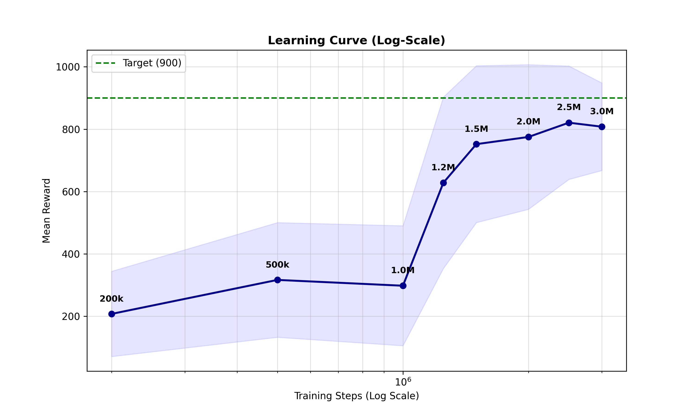
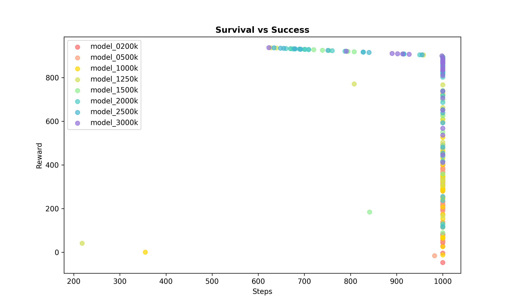
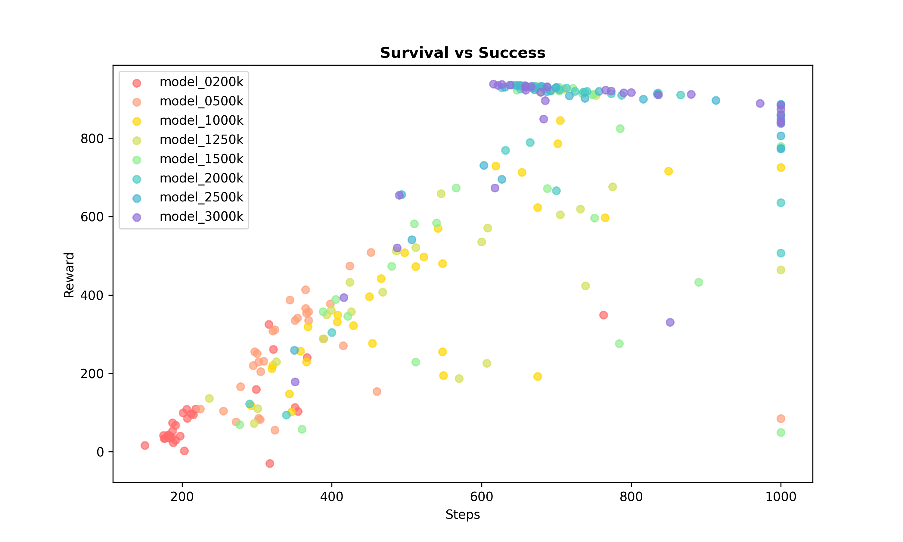
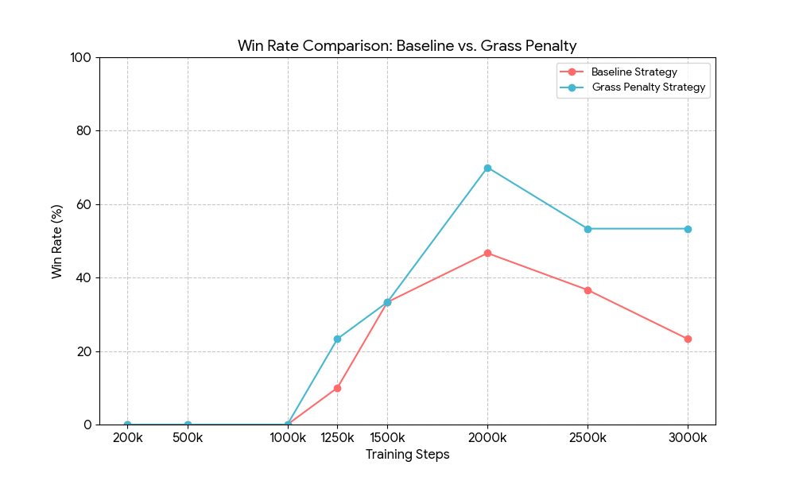

### 5.6 Strategy Comparison: Standard Training vs. Grass Penalty

In this final section, we contrast the performance of models trained with the baseline strategy (`train.py`) against those trained with the "Grass Penalty" strategy (`train2.py`). The objective is to evaluate whether explicitly penalizing going off-track improves robustness and driving quality.

#### 5.6.1 Definition of Strategies
We trained two sets of agents under the same hyperparameter conditions (PPO), varying only in their interaction with the environment. As detailed in **Section 5.1.2**, where the reward engineering is explained in depth, we compared:

1.  **Standard Strategy (Baseline):** The agent operates with the default reward structure of the `CarRacing-v2` environment, without modifications.
2.  **Penalty Strategy (Grass Penalty):** The agent is trained using the `GrassPenaltyWrapper` (see **Section 5.1.2**). This configuration actively penalizes the agent for driving on the grass and forces early termination if the car remains off-track, prioritizing precision over exploration.

#### 5.6.2 Learning Curve Analysis

The following graph compares the evolution of the **Mean Reward** over 3 million training steps for both strategies.

    

        
        
<em>Figure A: Learning Curve (Model A - Baseline)</em>

    

    

        
        
<em>Figure B: Learning Curve (Model B - Grass Penalty)</em>

    

**Data Interpretation:**
* **Intrinsic Difficulty & Reward Scaling:** It is crucial to note that the **Grass Penalty** model operates under a stricter reward function.  Therefore, obtaining a high reward is significantly harder in the penalized environment; the agent must drive "cleanly" to match the score of a baseline agent that might be cutting corners.
* **Learning Onset:** Consequently, the *Grass Penalty* model shows lower initial performance (Mean Reward ~91 at 200k steps) compared to the *Baseline* (~207). The agent is not only learning to drive but also struggling against negative feedback and early termination penalties.
* **Convergence and Superiority:** Despite this handicap, the penalized model recovers rapidly. By the end of training (2.5M - 3M steps), it surpasses the baseline, maintaining a mean reward consistently above **800** points. This indicates that the policy learned under stricter constraints is ultimately more efficient and robust than the one learned in a permissible environment.

#### 5.6.3 Survival and Efficiency Analysis (Scatter Survival)

This comparison provides the most striking visual evidence of how the penalty alters the learning process. The following graphs plot the relationship between the duration of the episode (Steps) and the total reward obtained.

    

        
        
<em>Figure A: Scatter Survival (Model A - Baseline)</em>

    

    

        
        
<em>Figure B: Scatter Survival (Model B - Grass Penalty)</em>

    

**Behavior Analysis:**
* **Early Termination vs. Timeout:** A critical difference observed in the data is the duration of failed episodes.
    * In the **Baseline** model, immature agents (e.g., 200k) tend to exhaust the maximum time (Avg Steps ~1000), suggesting the car gets stuck driving in circles or spinning without completing the track.
    * In the **Grass Penalty** model, immature agents have a very low average duration (~242 steps). The *wrapper* cuts the episode as soon as the agent fails, accelerating the feedback loop: the agent quickly learns that "going off-track = game over".
* **Win Rate:** The final impact of this strategy is vastly superior reliability. The best penalized model achieves a win rate of **70%**, while the best standard model barely reaches **46.6%**. The "Grass Penalty" agent learns to complete the circuit validly much more frequently.

* **Survival vs. Termination (The 1000-Step Wall):**
    There is a fundamental difference in the "failure mode" of the agents.
    * In **Figure A (Baseline)**, we observe a high density of points reaching the limit of **1000 steps** with low rewards. This indicates that the agent frequently "survives" the entire episode driving on the grass or looping without making progress. Since the environment does not terminate these episodes, the agent wastes training time accumulating negligible rewards.
    * In **Figure B (Grass Penalty)**, this cluster of "long failures" disappears. The penalty forces early termination when the agent leaves the track, clearing the graph of useless long episodes and allowing the agent to restart and learn faster.

* **Consistency in Reward Dynamics:**
    Despite the difference in survival, the **linear trend** (the slope of the points) remains remarkably similar between the two models for the successful episodes. This suggests that the core mechanism of accumulating reward (speed vs. distance covered) behaves similarly in terms of "points per step" once the car is on track.

* **Implications for Control:**
    However, this quantitative similarity in the reward/step ratio masks a qualitative difference in *how* that reward is achieved. As we will analyze in the next section (**5.6.4**), while the reward accumulation rate appears similar, the **control behavior** required to maintain that rate without touching the grass (Model B) is  different from the looser driving style of Model A. Furthermore, these substantial behavioral differences are clearly observable in the video recordings, a visual analysis of which will be detailed in **Section 5.6.5**.

#### 5.6.4 Control Analysis: Steering, Throttle, and Brake

Finally, we analyze the specific control actions (Steering, Gas, Brake) to understand the behavioral profile of each agent.

| Metric (3M Model) | Baseline | Grass Penalty |
| :--- | :---: | :---: |
| **Steering Std Dev** | 1.01 | **1.68** |
| **Throttle Mean** | **0.38** | -0.52 |
| **Brake Mean** | **-0.50** | -1.39 |
| **Win Rate** | 23.3% | **53.3%** |

*Note: In the PPO continuous action space, values > 0 activate the pedals. A higher mean implies more frequent and intense usage.*

**Analysis:**

1.  **Steering:**
    The penalized model presents a significantly higher standard deviation in steering (**1.68** vs 1.01). This indicates a **reactive and corrective** driving style.
    * **Stricter Racing Line:** This difference is also fundamentally due to the path taken. The *Baseline* model often "straightens" curves by cutting through the grass, requiring less steering input but failing the objective.
    * **Active Control:** In contrast, the *Grass Penalty* agent is forced to follow the track geometry strictly. It cannot shortcut; therefore, it must actively manipulate the steering wheel more to navigate the curves properly while staying on the gray asphalt.

2.  **Throttle and Brake:**
    The **Baseline** model exhibits much higher usage of both the Accelerator (**0.38**) and Brake (**-0.50**) compared to the penalized model (which has lower or negative means, indicating less activation).
    * **Interpretation:** The Baseline agent drives more aggressively and faster, but this behavior is inefficient. The higher pedal usage is largely a symptom of its inability to stay on track; it frequently needs to brake hard to stop spinning or accelerate aggressively to rejoin the asphalt from the grass.
    * **Efficiency:** The *Grass Penalty* agent, by maintaining a valid racing line, preserves momentum better. It adopts a smoother throttle control (coasting more often), avoiding the stop-and-go patterns typical of an agent recovering from off-track excursions.

#### 5.6.5 Visual Behavioral Analysis (Video Case Studies)

To fully comprehend the qualitative differences discussed in the previous sections, **we strongly recommend viewing the attached video recordings**. The data metrics alone cannot fully convey the drastic difference in driving "personality" between the two models.

Below, we analyze two specific instances that perfectly encapsulate the behavioral divergence between Model A (Baseline) and Model B (Grass Penalty).

##### Case Study 1: Intermediate Training (2.5M Steps - Episode 025)

* **Model A (Baseline - `eval_model_2500k_ep025`):**
    The behavior is erratic. After an initial contact with the grass, the agent loses stability and enters a spin. Notably, when rejoining the track, it does so **in the opposite direction** or in a completely uncontrolled manner. Despite this severe error, the agent continues to operate until it encounters a section of tight curves, where it loses control again. This illustrates a lack of understanding of track constraints; the agent "survives" but does not "drive".

* **Model B (Grass Penalty - `eval_model_2500k_ep025`):**
    In stark contrast, the penalized model demonstrates precision. It completes the lap successfully, negotiating all curves correctly. Instances of touching the grass are rare and much less abrupt. Crucially, when it does deviate slightly, the **recovery is immediate and controlled**, rejoining the asphalt quickly and maintaining the correct racing line. This aligns with the higher *Steering Std Dev* observed in data, reflecting active correction.

##### Case Study 2: Final Model (3.0M Steps - Episode 000)

* **Model A (Baseline - `eval_model_3000k_ep000`):**
    This video highlights the "cheating" behavior permitted by the baseline reward.
    1.  **Corner Cutting:** In the first tight curve, the agent clearly shortcuts through the grass to maintain speed.
    2.  **Excessive Aggression:** In the fast curve section, the agent maintains excessive speed, leading to an abrupt loss of control and a spin.
    3.  **Inefficient Survival:** Although it recovers and continues, it eventually drifts back onto the grass. It fails to complete the lap, with the episode terminating due to the **1000-step timeout**. The agent spent significant time alive but failed to achieve the objective.

* **Model B (Grass Penalty - `eval_model_3000k_ep000`):**
    The behavior here is defined by **caution and consistency**. The agent drives noticeably slower (less aggressive throttle usage, as seen in Section 5.6.4), but follows the track geometry perfectly. It does not cut corners. It successfully completes the lap just before the 1000-step limit. While less "flashy" or fast in straight lines, it is reliable, prioritizing staying *on* the road over raw speed.

#### 5.6.6. Comparative Win Rate Analysis

To conclude the comparison, we present the evolution of the **Win Rate** (percentage of episodes where the agent scores > 900 points) across the entire training history. This metric is the ultimate indicator of success.

| Checkpoint (Steps) | Baseline Win Rate (%) | Grass Penalty Win Rate (%) |
| :--- | :---: | :---: |
| **200k** | 0.0% | 0.0% |
| **500k** | 0.0% | 0.0% |
| **1000k** | 0.0% | 0.0% |
| **1250k** | 10.0% | **23.3%** |
| **1500k** | 33.3% | 33.3% |
| **2000k** | 46.7% | **70.0%** |
| **2500k** | 36.7% | **53.3%** |
| **3000k** | 23.3% | **53.3%** |

    
    
<em>Figure 5.6.3: Comparative Evolution of Win Rate (Success > 900 pts)</em>

The data reveals a critical trend. While both models begin to solve the track around 1.25M steps, the **Baseline model is unstable**. Its performance peaks at 2M steps (46.7%) but then degrades significantly towards the end of training (dropping to 23.3%), likely due to overfitting to "cheating" strategies that eventually fail.

In contrast, the **Grass Penalty model is far more robust**. Once it learns to drive (post-1.5M), it consistently maintains a higher win rate, peaking at **70%** and remaining above 50% even in the final stages. This confirms that penalizing off-track behavior leads to a policy that is not only safer but also fundamentally more successful at completing the race. **As can be observed from the data, Model B performs better.**

#### 5.6.7. Final Conclusion: Validation of the "Grass Penalty" Hypothesis

The comparative analysis allows us to confirm that **the initial hypothesis has been successfully validated**: introducing an explicit penalty for leaving the track (`GrassPenaltyWrapper`) produces a significantly more robust, reliable, and safer autonomous driving agent than the standard training strategy.

This conclusion is justified by the convergence of quantitative metrics and behavioral observations detailed throughout Section 5.6:

1.  **Superior Reliability (Win Rate):**
    The most definitive metric is the success rate. The **Grass Penalty** model achieved a peak win rate of **70%**, whereas the **Baseline** model stalled at **46.7%** and demonstrated severe instability, degrading to 23.3% in the final stages. This proves that the penalized agent is not just "luckier" but possesses a fundamentally more consistent driving policy.

2.  **Elimination of "Reward Hacking":**
    The analysis in **Section 5.6.3** revealed that the Baseline agent often maximizes its reward by exploiting the environment—cutting corners through the grass or "surviving" for 1000 steps without completing the lap. By enforcing early termination and negative rewards for off-track behavior (as defined in `utils2.py`), the Grass Penalty model was forced to unlearn these cheating strategies. This resulted in a **stricter racing line** and higher steering engagement (**1.68** std dev vs **1.01**), indicating active path correction rather than passive survival.

3.  **Enhanced Safety and Control:**
    The control analysis (**Section 5.6.4**) demonstrated that the penalized agent operates with greater efficiency. While the Baseline model relies on erratic high-speed maneuvers (high throttle/brake usage) and frequent recoveries from spins, the Grass Penalty model prioritizes **stability**. It uses the throttle and brake less aggressively, maintaining momentum through valid racing lines rather than stop-and-go corrections.

**Summary:**
While the "Grass Penalty" strategy increases the initial difficulty of the learning task, it effectively solves the **credit assignment problem**. It ensures that high rewards are only accessible through legitimate driving, leading to a model that is arguably the "better driver" in every meaningful capacity—safer, more consistent, and strictly adherent to track boundaries.

